# 8. 컴포넌트 스타일링

<br/>

## 8-1. 일반 CSS

* 컴포넌트를 스타일링하는 가장 기본적인 방식
* css 작성시 중요한 점은 css 클래스를 중복되지 않게 만드는 것이다
* 적용 방식은 작성한 css를 적용할 컴포넌트 안에 참조시키는 것이다.

```js
import '...css 파일경로...'
```

## 8-2. Sass

* 자주 사용되는 CSS 전처리기중 하나로 확장된 CSS 문법
* 스타일 코드의 재활용성을 높여주며 코드의 가독성을 높여 유지보수가 쉽다.
* sass 는 두가지 확장자를 지원하는데 sass 와 scss를 지원한다
  * 주요 차이점은 sass 확장자는 중괄호 ({}) 와 세미콜론 (;)을 사용하지 않는다 반면 scss는 기존 css를 작성하는 방식과 비교해 크게 다르지 않다

### sass 실습

```scss
//변수와 함수를 지정한 utils.scss

//변수 사용하기

$red : #fa5352;
$orange: #fd7e14;
$yellow: #fcc419;
$green:#40c507;
$blue:#339af0;
$indigo:#5c7cfa;
$violet:#7950f2;

//믹스인 만들기 (재사용되는 스타일 블록을 함수처럼 사용할수 있다)
@mixin square($size) {
    $calculated :32px * $size;
    width: $calculated;
    height: $calculated;
}

//utils.scss를 import 받아 스타일시트를작성한 sassComponent.scss
@import './utils.scss';

.SassComponent {
    display: flex;
    .box { 
        background: red;
        cursor: pointer;
        transition: all 0.3 ease-in;
        &.red {
            // .red 클래스가 .box와 함께 사용되었을때
            background: $red;
            @include square(1);
        }
        &.orange {
            background: $orange;
            @include square(2);
        }
        &.yellow {
            background : $yellow;
            @include square(3);
        }
        &.green {
            background : $green;
            @include square(4);
        }
        &.blue {
            background : $blue;
            @include square(5);
        }
        &.indigo {
            background : $indigo;
            @include square(6);
        }
        &.violet {
            background : $violet;
            @include square(7);
        }
        &:hover {
            background: black;;
        }
    }
}
```
```js
//scss를 참조받아 jsx를 작성한 MyComponents.js
import React from 'react';
import '../assets/sass/SassComponent.scss';


const MyComponent = () => {

    return (
        <div className='SassComponent'>
            <div className="box red"/>
            <div className="box orange"/>
            <div className="box yellow"/>
            <div className="box green"/>
            <div className="box blue"/>
            <div className="box indigo"/>
            <div className="box violet"/>
        </div>
    );
};

export default MyComponent;
```

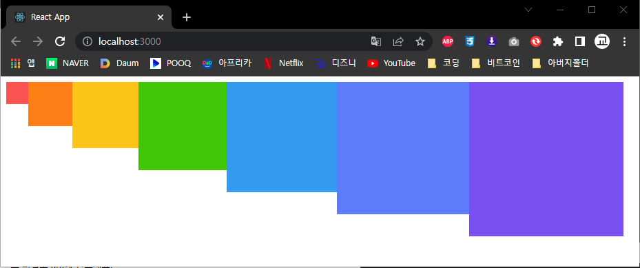


## 8-3. CSS Module

* 스타일을 작성할 때 CSS 클래스가 다른 CSS 클래스의 이름과 절대 충돌하지 않도록 파일마다 고유한 이름을 자동으로 생성해 주는 옵션이다
* CSS를 불러와서 사용할 때 클래스 이름을 고유한값 즉 파일이름_클래스이름_해시값 형태로 자동으로 만들지기에 클래스 이름이 중첩되는 현상을 방지해 준다
* css module을 사용하기 위해 구버전은 웹팩에서 css-loader 설정을 별도로 해주어야 했지만 v2 버전 이상부터는 설정할 필요없이 (.module.css)확장자로 파일을 지정하기만 하면 된다
* 두개 이상의 className을 한 태그에 적용하려면 백틱(` `)을 사용하여 (className={`${css파일명.클래스이름 ${css파일명.클래스이름`})으로 적용하여도 되지만 리액트 패키지중 하나인 classnames를 사용하는것이 좋다
* classnames를 사용하기위해선 프로젝트 디렉토리에서 명령프롬프트 or 터미널로 들어가 (yarn add classnames)를 입력하여 패키리를 먼저 설치해줘야 한다.
* 일반적으로 사용할때는 (className={classnames(클래스이름,클래스이름)})으로 쓰여지지만 classnames의 내장 함수인 `bind` 를 사용하면 더 효율적인 코딩을 할수있다
* const abc = classnames.bind(css파일명) 로 미리 css파일에서 클래스를 받아 오도록 설정하고 사용할때는 (className={abc('클래스이름','클래스이름)}) 로 적용할수 있다.


<br>

### CSS Module 실습

```js
import React from 'react';
import SassComponent from '../assets/sass/SassComponent.scss';
import classNames from 'classnames/bind';

const cx = classNames.bind(SassComponent);

const MyComponent = () => {
    return(
        <div className={cx('wrapper','inverted')}>
            안녕하세요, 저는 <span className="something">CSS Module!</span>
        </div>
    );
};

export default MyComponent;
```
```scss
.wrapper {
    background: black;
    padding: 1rem;
    color: white;
    font-size: 2rem;
    &.inverted {
        //inverted와 wrapper가 함께 적용된 태그에 이 scss가 적용된다
        color: black;
        background: white;
        border: 1px solid black;
    }
    .something {
         
        font-weight: 800;
        color: aqua;
        
    }
}
```

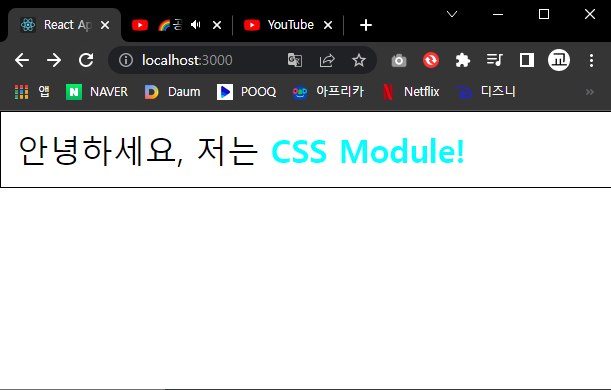

<br>

## 8-4. styled-components
<br>

* 스타일을 자바스크립트 파일에 내장시키는 방식 스타일을 작성함과 동시에 해당 스타일이 적용된 컴포넌트를 만들수 있게 해준다.
* 자바스크립트 파일안에 스타일을 선언하는 방식을 CSS-in-JS 라고 부른다
* 사용하기 위해서 패키지를 설치해야 한다 해당 프로젝트가 있는 디렉토리로 명령프롬프트 or 터미널로 이동하여 `(yarn add styled-components)` 를 설치해야 한다
* props를 참조한다면 반드시 css로 감싸주어서 Tagged 템플리스 리터럴을 사용해주어야한다.

<br>

### styled-components 실습

```js
import React from 'react';
import styled ,{css} from 'styled-components';

const Box = styled.div`
    background: ${props => props.color || 'blue'};
    padding: 1rem;
    display: flex;

    /**기본적으로 가로 크기 1024px에 가운데 정렬을 하고 가로 크기가 작아짐에 따라 크기를 줄이고  786px 미만이 되면 꽉채운다 */
    width: 1024px;
    margin: 0 auto;
    @media (max-width: 1024px) {
        width: 786px;
    }
    @media (max-width: 786px) {
        width: 100%;
    }
`;
const Button = styled.button`
    background: white;
    color: black;
    border-radius: 4px;
    padding: 0.5rem;
    display: flex;
    align-items: center;
    justify-content: center;
    box-sizing: border-box;
    font-size: 1rem;
    font-weight: 600;

    &:hover {
        background: rgba(225,225,225,0.9);
    }
    ${props =>
    props.inverted &&
    css`
    background: none;
    border: 2px solid white;
    color: white;
    &:hover {
        background: white;
        color: black;
    }
    `};
    & +button {
        margin-left: 1rem;
    }
`;


const MyComponent = () => {
    return(
        <Box color='black'>
            <Button>안녕하세요</Button>
            <Button inverted={true}>테두리만</Button>
        </Box>
    );
};

export default MyComponent;
```

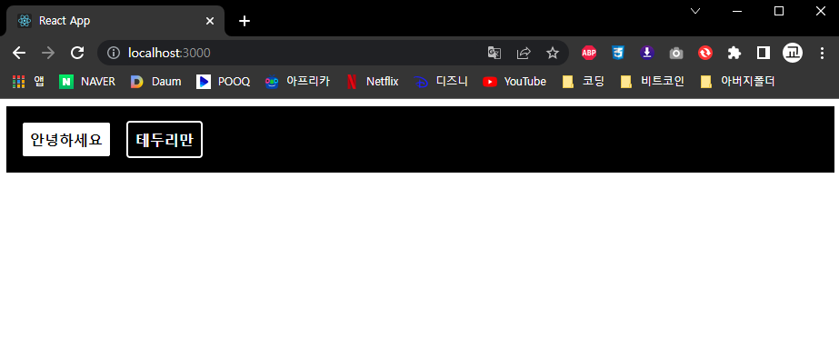
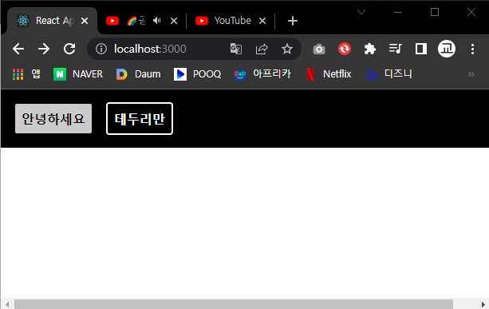

<br>


# 9. 리액트 라우터로 SPA 개발

<br>

## 9-1. 라우팅이란?

* 라우팅의 개념은 사용자가 요청한 URL에 따라 알맞은 페이지를 보여주는 것을 의마한다.
* 여러 페이지로 구성된 웹 애플리케이션을 만들 때 페이지 별로 컴포넌트들을 분리해가며 프로젝트를 관리하기 위해 필요하다
* 리액트 라우터를 사용하면 손쉽게 싱글 페이지 애플리케이션을 만둘수 있다
* 리액트에서 라우트 시스템을 구축하기 위해 사용할수 있는 선택지는 크게 두가지 이다
  * 리액트 라우터(React-Router)
    * 이 라이브러리는 리액트 라우팅 관련 라이브러리중 가장 오래되었고 가장 많이 사용되고 있는 라이브러리 이며 컴포넌트 기반으로 라우팅 시스템을 설정할수 있다
  * Next.js
    * 리액트 프로젝트의 프레임워크 이다
    * 리액트 프로젝트 설정, 라우팅 시스템,최적화, 다국어 시스템지원, 서버 사이드 렌더링등 다양한 기능을 제공한다.

<br>

## 9-2. 싱글페이지 애플리케이션 멀티페이지 애플리케이션

* 멀티 페이지 애플리케이션
  * 사용자가 다른 페이지로 이동할 때마다 새로운 html을 받아오고 페이지를 로딩할 때마다 서버에서 css,js,이미지 파일등의 리소스를 전달받아 브라우저 화면에 보여준다
  * 사용자 인터랙션이 없는 정적인 페이지 들에겐 적합하지만 인터랙션이 많고 다양한 정보를 제공하는 모던 웹 애플리케이션은 적합하지 않다
* 싱글 페이지 애플리케이션
  * html을 한번만 받아와 웹 애플리케이션을 실행시킨 뒤 , 이후 필요한 데이터만을 받아와서 화면에 업데이트하는것이 싱글 페이지 애플리케이션이다
  * 싱글 페이지 애플리케이션은 기술적으로는 한페이지만 존재하지만 사용자가 경험하기에는 여러 페이지가 존재하는 것처럼 느낄 수 있다.
  

<br>

## 9-3. 리액트 라우터 적용 및 기본 사용법

* 우선 선행하여 명령프롬프트 or 터미널을 사용하여 프로젝트가 있는 디렉토리로 이동하여 패키지를 설치해준다
  * yarn add react-router-dom
* index.js 에서 (import {BrowserRouter} from 'react-router-dom')를 참조한뒤 `(<App/>)`을 `(<BrowserRouter></BrowserRouter>)` 로 감싸준다
* App.js 에서 (import {Routes(Route를 감쌀 태그역활) ,Route,Link}) from 'react-router-dom')을 참조한다
* `(<Routes></Routes>)` 내부에 `(<Route path='주소규칙' element={<컴포넌트이름/>} />)` 를 명시한다
* 페이지 이동을 위해선 `(a)` 태그가 아닌 `(Link)` 를 사용한다
* 

<br>

### 기본 사용법
  

```js
//index.js
import React from 'react';
import ReactDOM from 'react-dom/client';
import App from './App';
import {BrowserRouter} from 'react-router-dom';

const root = ReactDOM.createRoot(document.getElementById('root'));
root.render(
  <React.StrictMode>
    <BrowserRouter>
      <App />
    </BrowserRouter>
  </React.StrictMode>
);
//App.js
import {Link,Routes,Route} from 'react-router-dom'
import Home from './pages/Home.js'
import About from './pages/About.js'

const page = () => {
    return (
        <Routes>
            <Route path='/' element={<Home/>}/>
            <Route path='/about' element={<About/>}/>
        </Routes>
    )
}
export default page;
//pages > Home.js
import React from 'react';
import {Link} from 'react-router-dom';

const Home = () => {
    return (
        <div>
            <h1>홈</h1>
            <p>가장 먼저 보여지는 페이지 입니다.</p>
            <Link to='/about'>소개 페이지</Link>
        </div>
    );
};

export default Home;
//pages > About.js
import React from 'react';

const About = () => {
    return (
        <div>
            <h1>소개</h1>
            <p>리액트 라우터를 사용해 보는 프로젝트입니다.</p>
        </div>
    );
};

export default About;
```

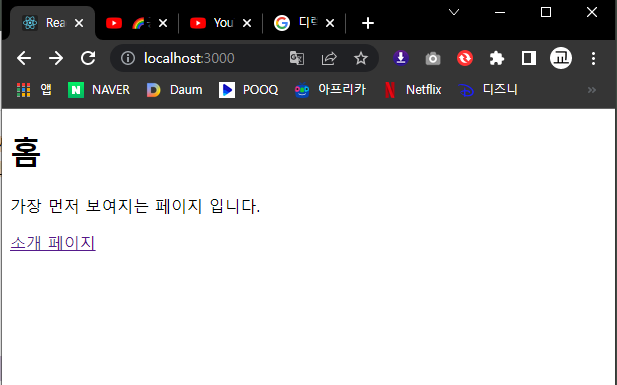
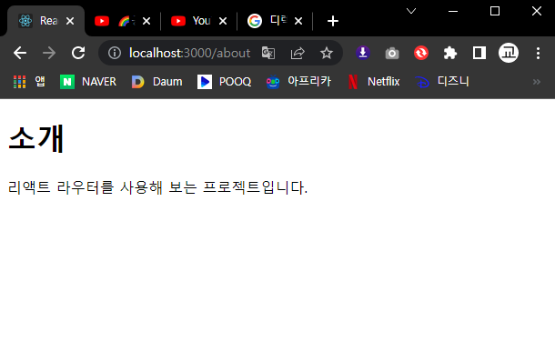

<br>

## 9-4. URL 파라미터와 쿼리스트링

<br>

* 페이지 주소를 정의할 때 유동적인 값을 사용해야 할때가 있다

* URL 파라미터 예시 : /profile/velopert
  * URL 파라미터의 경우 유동적인 값을 넣는 형태이다
  * URL 파라미터는 주로 ID 또는 이름을 사용하여 특정 데이터를 조회 할 때 사용한다
  * URL 파라미터는 useParams라는 Hook을 사용하여 객체 형태로 조회할 수 있다. URL 파라미터의 이름은 설정할 때 Route 컴포넌트의 path props를 통해 설정한다.
  * 밑에 실습의 경우 path 에 `(/profile/:username)` 이라고 설정한뒤 Home.js 에서 Link 태그에 `(/profile/velopert)`라는 props를 주었다
  * Link를 통해 들어가면 우선 useParams() 함수를 통해 값을 오브젝트 형식으로 받고 오브젝트를 가공한 값을 변수로 받아 해당 변수가 존재한다면 준비해준 JSX태그를 보여주고 없다면 존재하지 않는파일이라는 JSX태그를 보여주었다

* 쿼리스트링 예시 : /articles?page=1&keyword=react
  * 쿼리스트링의 경우 주소의 뒷부분에 `(?)` 문자열 이후에 key=value 로 값을 정의하며 & 구분하는 형태이다
  * 쿼리스트링은 키워드 검색,페이지네이션,정렬 방식 등 데이터 조회에 필요한 옵션을 전달할 때 사용한다.
  * 쿼리스트링은 페이지의 정보를 가져오기 위해 useLocation()이라는 함수를 사용한다
  * useLocation()함수를 사용하기 위해 (import {useLocation} from 'react-router-dom')을 참조 해 준다.
  * useLocation Hook은 location 이라는 객체를 반환하는데 이객체에는 아래와 같은 값들이 있다
    * pathname : 현재 주소의 경로(쿼리스트링 제외)
    * search : 맨 앞의 ? 문자를 포함한 쿼리스트링 값
    * hash : 주소의 # 문자열 뒤의 값
    * state : 페이지로 이동할 때 임의로 넣을 수 있는 상태 값
    * key : location 객체의 고유값, 초기에는 default이며 페이지가 변경될 때마다 고유의 값이 생성된다.
  * search를 이용해 ? 문자를 포함한 쿼리스트링 값을 받으면 ? 를 지우고 key와 value를 분리하는 작업을해야 하지만 `useSearchParams`을 사용한다면 더욱 쉽게 값을 가져올수 있다.
  

### URL 파라미터 실습

```js
//App.js
import React from 'react';
import {Routes,Route} from 'react-router-dom'
import Home from './pages/Home.js'
import About from './pages/About.js'
import Profile from './pages/Profile.js'

function App() {

return (
    <div>
        <Routes>
            <Route path='/' element={<Home/>}/>
            <Route path='/about' element={<About/>}/>
            <Route path='/profile/:username' element={<Profile/>}/>
        </Routes>
    </div>
);
}

export default App;
//Profile.js
import { useParams } from "react-router-dom";

const data = {
    velopert: {
        name: '김민준',
        description: '리액트를 좋아하는 개발자',
    },
    gildong: {
        name: '홍길동',
        description: '고전 소설 홍길동전의 주인공',
    }

};

const Profile = () => {
    const params = useParams();
    console.log (params);
    const profile = data[params.username];

    return (
        <div>
        <h1>사용자 프로필</h1>
        {profile ? (<div><h2>{profile.name}</h2><h2>{profile.description}</h2></div>) : (<p>존재 하지 않는 프로필입니다.</p>)}
        </div>
    )
}
export default Profile;
//Home.js
import React from 'react';
import {Link} from 'react-router-dom';

const Home = () => {
    return (
        <div>
            <h1>홈</h1>
            <p>가장 먼저 보여지는 페이지 입니다.</p>
            <ul>
                <li>
                    <Link to='/about'>소개 페이지</Link>
                </li>
                <li>
                    <Link to='/profile/velopert'>velopert의 프로필</Link>
                </li>
                <li>
                <Link to='/profile/gildong'>gildong의 프로필</Link>
                </li>
                <li>
                <Link to='/profile/void'>존재하지 않는 프로필</Link>
                </li>
            </ul>
        </div>
    );
};

export default Home;
```
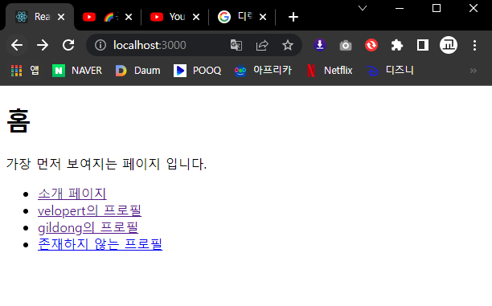
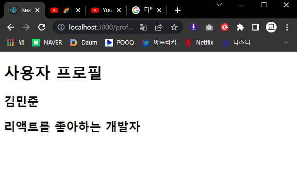
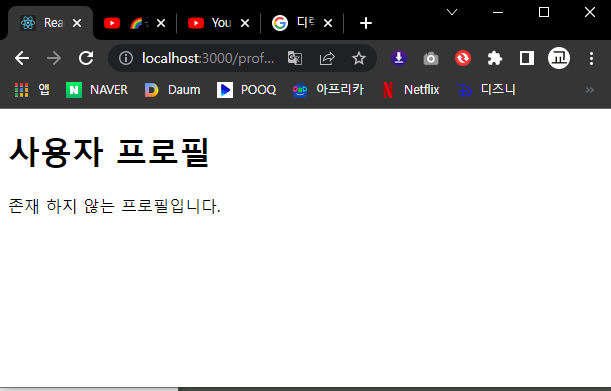

<br>

### 쿼리스트링 실습

```js
import React from 'react';
import {useLocation} from 'react-router-dom';

const About = () => {
    const location = useLocation();

    return (
        <div>
            <h1>소개</h1>
            <p>리액트 라우터를 사용해 보는 프로젝트입니다.</p>
            <p>쿼리스트링 : {location.search}</p>
        </div>
    );
};

export default About;
```

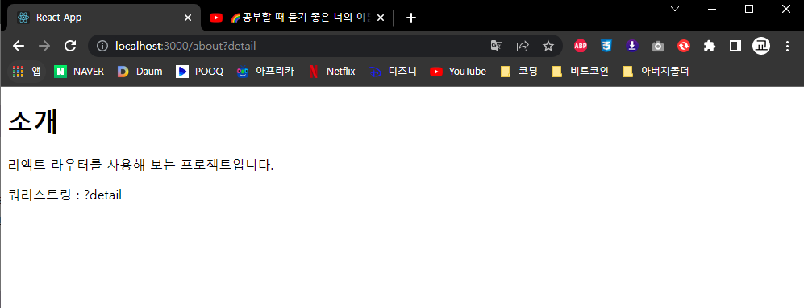

## 9-5. 중첩된 라우트

* 공통 레이아웃을 보여줘야 하거나 컴포넌트 안에서 Link를 통해 컴포넌트로 들어갔지만 목록 정의를 위해 부모 컴포넌트를 JSX내부에 다시 참조하여 넣어야할 상황이 있을 것이다.
*  이때 Outlet을 사용한다면 복잡하지 않고 쉽게 코드를 짤수 있다.

### 부모 컴포넌트를 내부에 다시 참조해야할 경우 Outlet사용법

```js
//App.js
import React from 'react';
import {Routes,Route} from 'react-router-dom'
import Home from './pages/Home.js'
import About from './pages/About.js'
import Profile from './pages/Profile.js'
import Articles from './pages/Articles.js'
import Article from './pages/Article.js'


function App() {

return (
    <div>
        <Routes>
            <Route path='/' element={<Home/>}/>
            <Route path='/about' element={<About/>}/>
            <Route path='/profile/:username' element={<Profile/>}/>
            <Route path='/articles' element={<Articles/>}>
            <Route path='/articles/:id' element={<Article/>}/>
            </Route>
        </Routes>
    </div>
);
}

export default App;
//Home.js
import React from 'react';
import {Link} from 'react-router-dom';

const Home = () => {
    return (
        <div>
            <h1>홈</h1>
            <p>가장 먼저 보여지는 페이지 입니다.</p>
            <ul>
                <li>
                    <Link to='/about'>소개 페이지</Link>
                </li>
                <li>
                    <Link to='/profile/velopert'>velopert의 프로필</Link>
                </li>
                <li>
                <Link to='/profile/gildong'>gildong의 프로필</Link>
                </li>
                <li>
                <Link to='/profile/void'>존재하지 않는 프로필</Link>
                </li>
                <li>
                <Link to='/articles'>게시물 목록</Link>
                </li>
            </ul>
        </div>
    );
};

export default Home;
//Articles.js
import React from 'react';
import {Link,Outlet} from 'react-router-dom'

const Articles = () => {
    return (
        <div>
        <Outlet/>
        <ul>
            <li>
                <Link to='/articles/1'>게시물1</Link>
            </li>    
            <li>
                <Link to='/articles/2'>게시물2</Link>
            </li>    
            <li>
                <Link to='/articles/3'>게시물3</Link>
            </li>    
        </ul>
        </div>
    );
};

export default Articles;
//Article.js
import React from 'react';
import {useParams} from 'react-router-dom';

const Article = () => {
    const {id} = useParams();
    return (
        <div>
            <h2>게시물 {id}</h2>
        </div>
    );
};

export default Article;
```

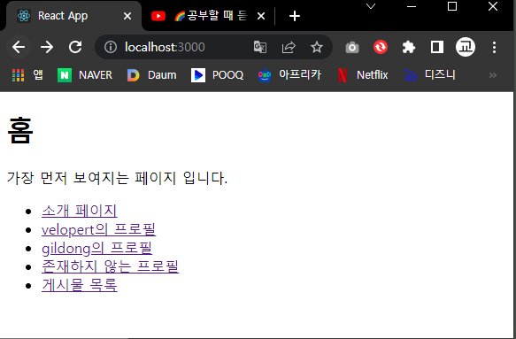;
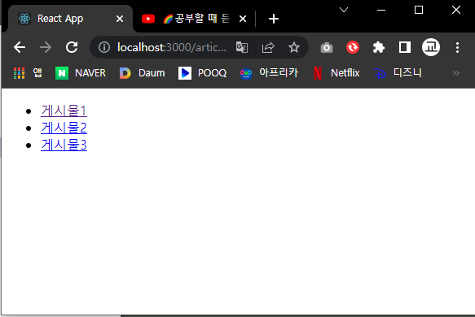;
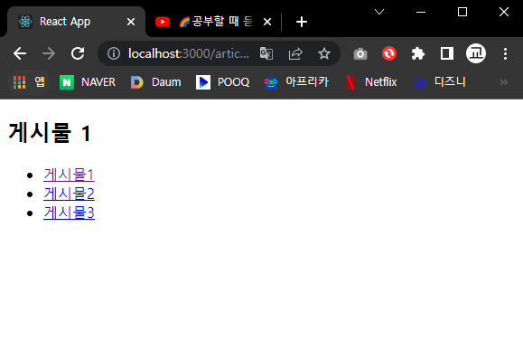;

<br>

### 공통 레이아웃 컴포넌트 Outlet사용법

```js
//App.js
import React from 'react';
import {Routes,Route} from 'react-router-dom'
import Home from './pages/Home.js'
import About from './pages/About.js'
import Profile from './pages/Profile.js'
import Articles from './pages/Articles.js'
import Article from './pages/Article.js'
import Layout from './pages/Layout.js';

function App() {

return (
    <div>
        <Routes>
            <Route element={<Layout/>}>
            <Route path='/' element={<Home/>}/>
            <Route path='/about' element={<About/>}/>
            <Route path='/profile/:username' element={<Profile/>}/>
            </Route>
            <Route path='/articles' element={<Articles/>}>
            <Route path='/articles/:id' element={<Article/>}/>
            </Route>
        </Routes>
    </div>
);
}

export default App;
//Layout.js
import React from 'react';
import {Outlet} from 'react-router-dom';

const Layout = () => {
    return (
        <div>
            <header style={{background:"lightgray", padding:16,fontSize:24}}>header</header>           
            <main>
                <Outlet/>
            </main>
        </div>
    );
};

export default Layout;
```

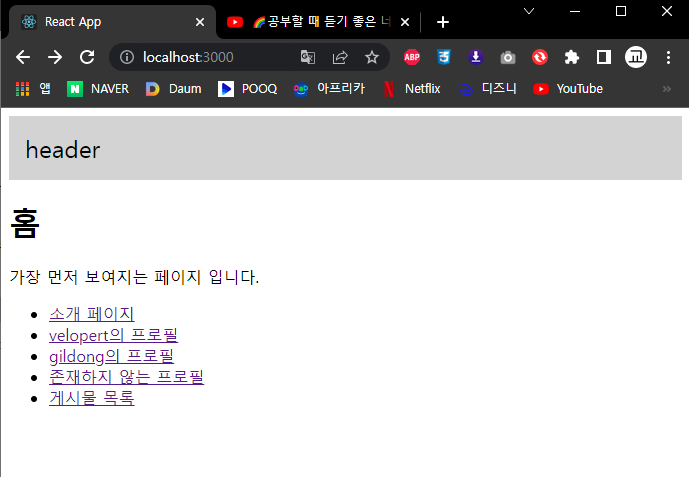
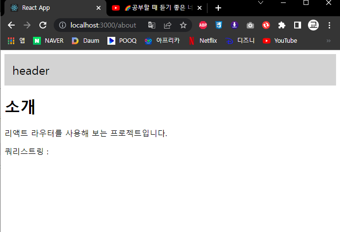
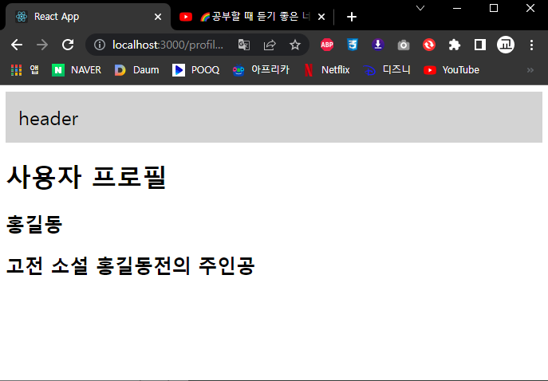

<br>

## 9-6. 리액트 라우터 부가 기능

<br>

### 1. useNavigate

* Link를 컴포넌트를 사용하지 않고 다른 페이지로 이동해야 하는 상황에 사용하는 Hook
* navigate 함수를 사용할 때 파라미터가 숫자 타입이라면 앞으로 가거나 뒤로 간다
  *  (-1) 인경우 뒤로가고 (-2)인 경우 뒤로 두번 이동한다 (1)인 경우 앞으로 간다
  *  하지만 앞으로 이동할 페이지가 없다면 이동하지 않는다.
* 문자열(path)가 적혀 있는경우 해당 페이지로 이동한다.


```js
//Layout.js
import React from 'react';
import {Outlet,useNavigate} from 'react-router-dom';

const Layout = () => {

    const navigate = useNavigate();
    const goBack = () => {
        navigate(-1);
    }
    const goArticles = () => {
        navigate('/articles');
    }
    return (
        <div>
            <header style={{background:"lightgray", padding:16,fontSize:24}}>
                <button onClick={goBack}>뒤로가기</button>
                <button onClick={goArticles}>게시글 목록</button>
            </header>    
            <main>
                <Outlet/>
            </main>
        </div>
    );
};

export default Layout;
```
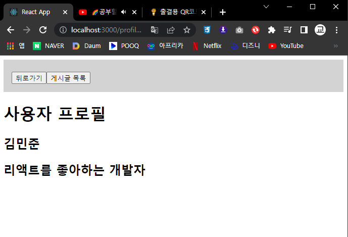
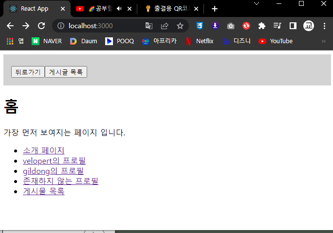

<br>

### 2. NotFound

* 사전에 정의되지 않는 경로에 사용자가 진입했을 때 보여주는 페이지
* 페이지를 찾을수 없을때 나타나는 페이지
  
```js
//App.js
import React from 'react';
import {Routes,Route} from 'react-router-dom'
import Home from './pages/Home.js'
import About from './pages/About.js'
import Profile from './pages/Profile.js'
import Articles from './pages/Articles.js'
import Article from './pages/Article.js'
import Layout from './pages/Layout.js';
import NotFound from './pages/NotFound.js';

function App() {

return (
    <div>
        <Routes>
            <Route element={<Layout/>}>
            <Route path='/' element={<Home/>}/>
            <Route path='/about' element={<About/>}/>
            <Route path='/profile/:username' element={<Profile/>}/>
            </Route>
            <Route path='/articles' element={<Articles/>}>
            <Route path='/articles/:id' element={<Article/>}/>
            </Route>
            <Route path='*' element={<NotFound/>}/>
        </Routes>
    </div>
);
}

export default App;
//NotFound.js
import React from 'react';

const NotFound = () => {
    return (
        <div
        style={{
            display: 'flex',
            alignItems: 'center',
            justifyContent: 'center',
            fontSize: 64,
            position: 'absolute',
            width: '100%',
            hegith: '100%',
        }}
        >
        404
        </div>
    );
};

export default NotFound;
```
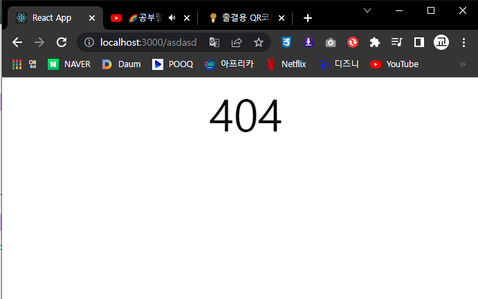

<br>

### 3. Navigate

* Navigate 컴포넌트는 컴포넌트를 화면에 보여주는 순간 다른 페이지로 이동을 하고 싶을때 사용하는 컴포넌트이다 즉 페이지를 리다이렉트하고 싶을때 사용한다
* 사용자가 로그인이 필요한 페이지에서 로그인을 하지 않았을 때..등등 로그인 페이지를 보여주어야 할 상황에 쓰인다

```js
//App.js
import React from 'react';
import {Routes,Route} from 'react-router-dom'
import Home from './pages/Home.js'
import About from './pages/About.js'
import Profile from './pages/Profile.js'
import Articles from './pages/Articles.js'
import Article from './pages/Article.js'
import Layout from './pages/Layout.js';
import NotFound from './pages/NotFound.js';
import Login from './pages/Login.js';
import MyPage from './pages/MyPage.js';

function App() {

return (
    <div>
        <Routes>
            <Route element={<Layout/>}>
            <Route path='/' element={<Home/>}/>
            <Route path='/about' element={<About/>}/>
            <Route path='/profile/:username' element={<Profile/>}/>
            </Route>
            <Route path='/articles' element={<Articles/>}>
            <Route path='/articles/:id' element={<Article/>}/>
            </Route>
            <Route path='/login' element={<Login/>}/>
            <Route path='/mypage' element={<MyPage/>}/>
            <Route path='*' element={<NotFound/>}/>
        </Routes>
    </div>
);
}

export default App;
//Login.js
import React from 'react';

const Login = () => {
    return (
        <div>
           로그인 페이지 
        </div>
    );
};

export default Login;
//MyPage.js
import React from 'react';
import {Navigate} from 'react-router-dom';

const MyPage = () => {
    const isLoggedIn = false;
    if (!isLoggedIn) {
        return <Navigate to="/login" replace={true}/>
    }
    return (
        <div>
            마이페이지          
        </div>
    );
};

export default MyPage;
```

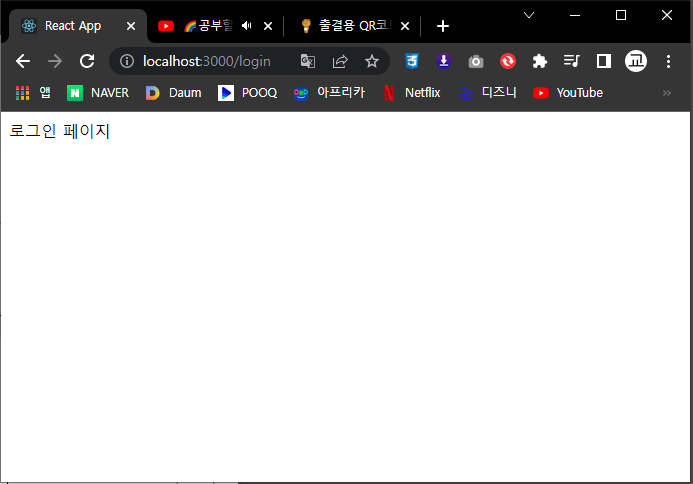
<br>

