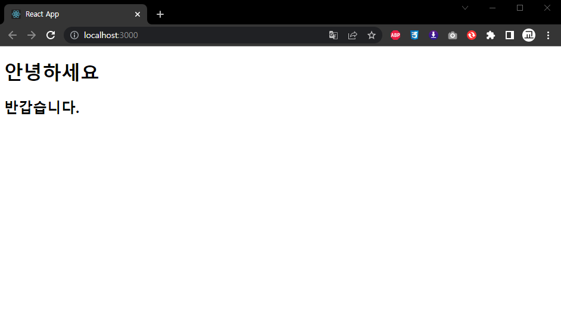
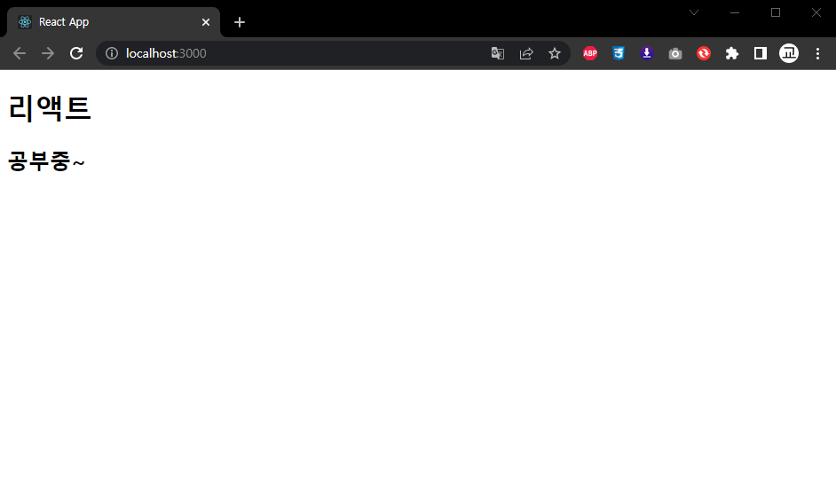
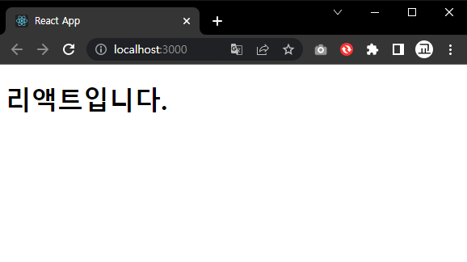
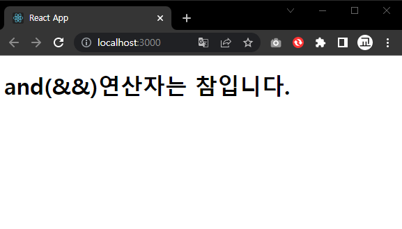
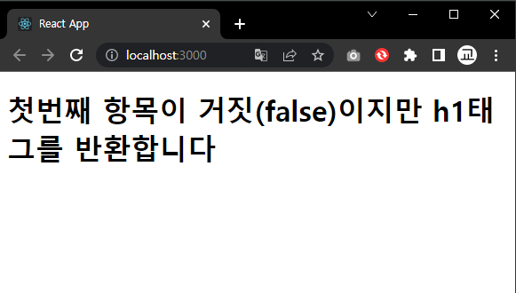
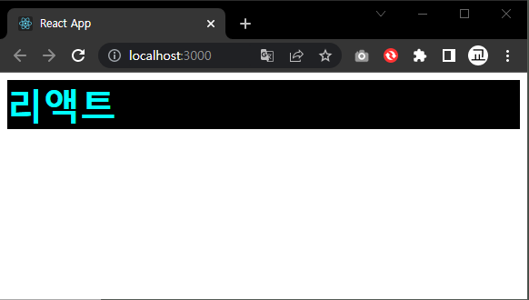

# 리액트를 다루는 기술 정리

<br/>

## 1. 리액트 시작

<br/>

### 1-1 왜리액트인가?

1. 리액트는 자바스크립트 라이브러리로 사용자 인터페이스를 만드는데 사용한다.
2. 구조가 MVC(Model-View-Controller),MVW(Model-View-Whatever)등인 프레임쿼크와 달리 오직 V(View)만 신경 쓰는 라이브러리이다
3. 리액트 프로젝트에서 특정부분이 어떻게 생길지 정하는 선언체가 있는데 이를 **컴포넌트**(component)라고 한다.
4. 리액트는 성능을 아끼고 최적의 사용자 경험을 제공할수 있게 렌더링과 리렌더링 과정을 거쳐 사용자에게 화면(View(DOM))을 제공한다
   1. 초기 렌더링은 어느 UI관련 프레임워크나 라이브러리를 사용하든지 간에 필요한 초기 랜더링 과정이다 리액트는 이를 다르는 render함수를 가지고 있다
   2. (reder(){...}) 함수는 컴포넌트가 어떻게 생겼는지 정의하는 역할을 하며 View가 어떻게 생겼고 어떻게 작동하는지에 대한 정보를 지닌 객체를 반환한다
   3. 최상위 컴포넌트의 랜더링 작업이 끝나면 지니고 있는 정보들을 사용하여 HTML 마크업(markup)을 만들고 이를 우리가 정하는 실제 페이지 DOM요소 안에 주입한다
   4. 그후 (업데이트)과정에서 새로운 데이터를 가지고 render 함수를 다시 호출하고 그데이터를 지닌 View를 생성한뒤 DOM에 바로적용하지않고 이전에 만들어졌던 정보와 비교한뒤 차이가 있는 데이터만을 DOM트리에 업데이트 한다.

<br/>

|용어의 정리|기능|설명|
|--|--|--|
||컴포넌트(Component)|* 컴포넌트는 재사용이 가능한 API로 수많은 기능들을 내장하고 있으며, 컴포넌트 하나에서 해당 컴포넌트의 생김새와 작동 방식을 정의한다<br/>* 리액트로 만들어진 앱을 이루는 최소한의 단위이다<br/>* 리액트에 쓰이는 컴포넌트는 클래형 컴포넌트와 함수형 컴포넌트가 있다 (최근에는 함수형 컴포넌트가 많이쓰인다)|
||렌더링(rendering)|* 사용자 화면에 뷰(DOM)를 보여주는 것을 랜더링이라고 한다|
||||

<br/>

### 1-2 리액트의 특징

1. 리액트의 주요 특징 중 하는 Virtual DOM을 사용하는 것이다
   1. 리액트에서의 Virtual DOM의 절차
      1. 데이터를 업데이트 하면 전체 UI를 (Virtual DOM)사본에 리렌더링 한다
      2. 이전에 만들어진 사본과 비교한다
      3. 바뀐 부분만을 실제 DOM에 적용한다
   2. Virtual DOM은 UI를 업데이트 하는 과정에서 생기는 복잡함을 모두 해소하고,더욱쉽게 업데이트에 접근할 수 있다.
2. 본인 취향의 라이브러리를 사용하여 스택을 설정할수 있는 장점이 있다
3. 여러 라이브러리를 접해야한다는 단점이 있다.
4. 다른 웹 프레임워크나 라이브러리와 혼용하여 사용할수 있다 ( ex : Backbone.js, AngularJS)

<br/>

|용어의 정리|기능|설명|
|--|--|--|
||DOM(Document Object Model)|* 객체로 문서 구조를 표현하는 방법으로 XML이나 HTML로 작정한다<br/>* 문제점으로 동적UI에 최적화 되어 있지 않아 js를 통해 동적으로 만들어야한다<br/>* DOM 자체는 빠르지만 웹브라우저 DOM에 변화가 일어나면 웹 브라우저가 CSS를 다시 연산하고 레이아웃을 구성하고 페이지를 리페인트하는 과정에서 시간이 많이 허비된다.|
||Virtual DOM|* 실제 DOM의 사본|
||||

<br/>

### 1-3 작업 환경설정

1. 리액트 프로젝트를 만들때는 반드시 Node.js를 설치해야 한다.
   1. 프로젝트를 개발하는데 필요한 주요 도구 들이 Node.js를 사용하기 때문
      1. 이 때 사용하는 개발도구로는 ECMAscript(2015년 공식적으로 업데이트한 자바스크립트 문법)을 호환시켜 주는 바벨(babel), 모듈화된 코드를 한 파일로 합치고(번들링) 코드를 수정할때마다 웹 브라우저를 리로딩하는 등의 여러 기능을 가진 웹팩(webpack),패키지 매니저 도구인 npm등이 있다.
   2.  설치 방법
       1.  macOS
           1.  터미널을 열고 명령어 `($ curl -o- https://raw.githubusercontent.com/nvm-sh/nvm/v0.38.0/install.sh | bash)`입력
           2.  터미널을 재시작하고 nvm이 설치되었는지 명령어로 확인 `($ nvm --version)`
           3.  버전이 나타나지 않는다면, vim 명령어를 입력하여 `(~/.bash_profile)` 파일에 다음 스크립트를 추가해야한다 
           4.  `($vim ~/.bash_profile export NVM DIR="$HOME/.nvm" [ -s "$NVM_DIR/nvm.sh"] && \. "$NVM_DIR/nvm.sh" # This loads nvm)`
           5.  nvm이 설치되었다면 명령어에 `($ nvm install --lts)`로 Node를 설치해준다.
       2. Window
          1. [Node.js 공식 홈페이지](https://nodejs.org/ko/download/)에서 Window installer를 내려받아 설치한다
          2. 설치 완료 후 제대로 설치되었는지 명령 프롬프트 에서 ($ node-v)명령어로 확인한다.
2. yarn 설치
   1. yarn은 npm을 대체할수 있는 도구로 npm보다 빠르며 효율적인 캐시 시스템과 기타 부가 기능을 제공한다
   2. 설치 방법
      1. 명령프롬프트 or 터미널에서 `(npm install -g yarn)`입력
      2. 설치에 실패할 경우
      3. window의 경우 : [설치파일](https://classic.yarnpkg.com/latest.msi)에서 직접 내려받아 오프라인 설치
      4. macOS의 경우 터미널에서`(brew install yarn)`입력하여 설치 수행
3. 프로젝트 생성하기
   1. 명령프롬프트 or 터미널에서 생성될 파일을 넣을 디렉토리도 이동하여 명령어 `(yarn create react-app 프로젝트이름)`입력
   2. 생성이 완료되었다면 생성한 폴더로 이동하여 필요한 패키지등을 명령어 `(yarn add 설치할 패키지 이름)` 을 사용하여 설치한다
   3. 모든것이 완료되었다면 명령어 `(yarn start)` 를 입력하여 프로젝트를 웹에서 실행시킨다


<br/>


## 2. JSX

<br/>

## 2-1. 코드 이해하기

<br/>

프로젝트를 생성하고 프로젝트 내부 src/App.js 파일을 열어보면 상단에 아래의 문구가 작성되어 있는것을 볼수 있다.
```js
import logo from './logo.svg';
import './App.css'
```
이 기능은 `(import)` 를 사용하여 다른 파일들을 불러와 사용하는 것으로 원래는 브라우저에는 없는 기능이다.<br/>
이를 자바스크립트에서 사용할수 있게 해주는 것이 Node.js 번들러인 웹팩(webpack)이라는 도구이다<br/>
번들러 도구를 사용하면 `(import)`로 모듈을 불러왔을 때 불러온 모듈을 모두 합쳐서 하나의 파일을 생성해 준다<br/>
또한 최적화 과정에서 여러개의 파일로 분리될 수도 있다.<br/>
웹팩을 사용하면 svg파일과 css파일도 위의 코드와 같이 참조해 사용할수 있다 이렇게 파일을 불러오는 것을 웹팩의 로더`(loader)`라는 기능이 당담하는데<br/>
css의경우 `(css-loader)`가 웹폰트나 미디어 파일등을 `(file-loader)`가 담당하여 불러온다<br/>
그리고 자바스크립트 파일들을 불러올때는 `(bable-leader)`가 담당하여 참조하지만 참조할때 바벨이라는 도구를 사용하여 최신 자바스크립트 문법으로 작성된 코드를 ES5문법으로 변화하여 준다<br/>
변환하는 이유는 구버전 웹 브라우저와 호환하기 위해서이며 JSX라는 문법도 정식 자바스크립트 문법이 아니므로 변환이 필요하다.<br/>

<br/>

## 2-2. JSX란?

* JSX는 자바스크립트의 확장 문법이다
* 가독성이 높고 작성이 쉬워 익숙하며 높은 활용도를 보여준다.
* 코드가 번들링 되는 과정에서 바벨을 사용하여 일반 자바스크립트 형태의 코드로 변환된다 (밑에 코드 참고)
```js
//리액트에서 변환이 일어나기 전에 코드
function App() {
    return (
        <div>
        Hello<b>React</b>
        </div>
    )
}
//리액트에서 변환이 된후에 코드
function App() {
    return React.createElement("div",null,"Hello",React.createElement("b",null,"React"));
}
```

## 2-3. JSX의 문법

<br/>

1. 컴포넌트에 여러 요소가 있다면 반드시 부모 요소 하나로 감싸야한다
```js
/** 에러가 발생할 문법 아래와 같은 에러가 발생한다
 * Parsing error:Adjacent JSX elements must be wrapped in an enclosing tag. Did you want a JSX fragment <>..</>
*/
function App() {
    return (
        <h1>안녕하세요</h1>
        <h2>반갑습니다.</h2>
    )
}
export default App;
//해결 방법(1)
function App() {
    return (
        <div>
        <h1>안녕하세요</h1>
        <h2>반갑습니다.</h2>
        </div>
    )
}
export default App;
//해결방법(2)
import {Fragment} from 'react';

function App() {
    return (
        <Fragment>
            <h1>안녕하세요</h1>
            <h2>반갑습니다.</h2>
        </Fragment>
    )
}
export default App;
//해결방법(3) Fragment의 다른 형태
function App() {
    return (
        <>
        <h1>안녕하세요</h1>
        <h2>반갑습니다.</h2>
        </h1>
    )
}
export default App;
```
<br/>



<br/>

2. 자바스크립트 표현

   1. JSX안에서는 자바스크립트 표현식을 사용할수 잇다 대신 JSX안에서 코드를 사용하려면 {} <로 감싸주어야 한다
```js
function App() {
    const name = '리액트';
    return (
        <>
        <h1>{name}</h1>
        <h2>공부중~</h2>
        </>
    );
};
export default App;
```


<br/>

3. if문 대신 조건부 연산자
   
   1. JSX 내부의 자바스크립트 표현식에서 if문을 사용할수 없다 필요할때는 조건부 연산다를 사용한다 (`(삼항연산자)` , `(and(&&))`, `(or(||))`) 

```js
//삼항연산자
//조건식의 내용이 참(true)일 경우 첫번째코드를 반환하고 거짓(false)일경우 두번째 코드를 반환한다.
function App() {
    const name = '리액트';
    return (
        <>
        {name === '리액트' ? (<h1>리액트입니다.</h1>) : (<h1>리액트가 아닙니다.</h1>)}
        </>
    );
};
export default App;
```


<br/>

```js
//and(&&) 연산자
//and 연산자는 안에 있는 모든 내용들이 참(true)일경우 코드를 반환한다 하나라도 거짓이있다면 반환하지 않는다.
function App() {
    const name = '리액트';
    return (
        <>
        {name === '리액트' && (<h1>and(&&)연산자는 참입니다.</h1>)}
        </>
    );
};
export default App;
```


<br/>

```js
//or(||) 연산자
//or 연산자는 안에 있는 내용들중 하나라도 참(true)일경우 코드를 반환한다 하나라도 거짓이있다면 반환하지 않는다.
function App() {
    const name = '뤼액트';
    return (
        <>
        {name === '리액트' || (<h1>첫번째 항목이 거짓(false)이지만 h1태그를 반환합니다</h1>)}
        </>
    );
};
export default App;
```



<br/>

4. 인라인 스타일링

   1. 리액트에서 DOM요소에 스타일을 적용할 때는 문자열 형태로 넣는것이 아니라 객체 형태로 넣어 주어야 한다
   2. 또한 카멜 표기법(camelCase)으로 작성해야 한다.
```js
//변수를 만들어 div 태그 style에 변수를 적용한경우
function App() {
    const name = '리액트';
    const style = {
        backgroundColor: 'black',
        color: 'aqua',
        fontSize: '40px',
        fontWeight: 'bold',
    }
    return (
        <div style={style}>
        {name}
        </div>
    );
};
export default App;

//변수를 만들지 않고 style 속성에 다이렉트로 값을 지정하는 경우
function App() {
    const name = '리액트';
    return (
        <div style={{
        backgroundColor: 'black',
        color: 'aqua',
        fontSize: '40px',
        fontWeight: 'bold',
    }}>
        {name}
        </div>
    );
};
export default App;
```



<br/>

5. class 대신 className

   1. html에서 일반적으로 사용하는 class를 JSX에서는 className으로 변경하여 사용한다

<br/>

6. 닫아야하는 태그
   1. html에서 는 `<br>` 태그 혹은 `<hr>` 태그와 같이 단일 태그에 경우 태그를 닫지 않아도 사용하는데 있어 불편함이 없이 작동한다
   2. 하지만 React에서는 오류가 발생한다
      1. `(Parsing error: Unterminated JSX contents)`  오류가 발생
   3. 오류를 해결해주기 위해서 `<br>` 태그를 `<br/>` 태그로 닫아준다.

<br/>

7. 주석
   1. 자바스크립트에서의 주석과 html의 주석방식이 틀리듯 JSX에서의 주석도 틀리다
   2. JSX에서 주석 작성시 `{/*...주석...*/}` or `<div 시작태그안에 여러 줄로 작성시 주석을 작성할수 있다 단일줄 일시 작성 불가능>..내용..</div>`