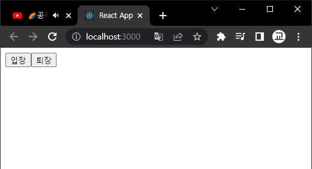

# 3. 컴포넌트

<br/>

## 3-1. 컴포넌트 생성

<br/>

### 1. 컴포넌트의 기능은 단순한 템플릿 이상이다. 데이터가 주어졌을대 이에 맞추어 UI를 만들어 주는것은 물론이고, hook기능을 이용하여 컴포넌트가 화면에서 나타날때, 사라질때, 변화가 일어날때 주어진 작업들을 처리할 수 있다
### 2. 컴포넌트의 형태로는 클래스형과 함수형 컴포넌트가 있지만 리액트 공식 메뉴얼에서는 컴포넌트르 새로 작성할 때 함수 컴포넌트와 Hooks를 사용하도록 권장하고 있다.
### 3. 함수를 생성한뒤 컴포넌트를 내보내기와 함수형 컴포넌트를 사용할 파일에서의 모듈 불러오기가 필요하다
```js
//컴포넌트 생성후 내보내기 (export)
import React from 'react';

const MyComponent = () => {
    return (
        <div>
            컴포넌트 실험~
        </div>
    );
};

export default MyComponent;

//컴포넌트를 불러오고 난후 적용한 App.js 코드
import React from 'react';
import MyComponent from './component/MyComponent';
function App() {
return (
    <div>
      <MyComponent/>
    </div>
);
}

export default App;
```


<br/>

## 3-2. props

<br/>

### 1. props는 properties를 줄인 표현으로 컴포넌트 속성을 설정할 때 사용하는 요소이다.
### 2. props 값은 해당 컴포넌트를 불러와 사용하는 부모 컴포넌트에서 설정할수 있다.

```js
//컴포넌트를 불러와 사용할때 props의 값을 전해준 App.js
import React from 'react';
import MyComponent from './component/MyComponent';
function App() {
return (
    <div>
      <MyComponent name="이교헌"/>
    </div>
);
}

export default App;

//props의 값을 받아 JSX에 적용한 컴포넌트
import React from 'react';
import PropTypes from 'prop-types';

const MyComponent = props => {
    return (
        <div>
            안녕하세요 ,제이름은 {props.name} 입니다.
        </div>
    );
};

export default MyComponent;

//props에서 전달해준 값을 비구조문법으로 가공하여 사용한 컴포넌트
import React from 'react';
import PropTypes from 'prop-types';

const MyComponent = props => {
    const {name} = props;
    return (
        <div>
            안녕하세요 ,제이름은 {name} 입니다.
        </div>
    );
};

export default MyComponent;

//props에서 전달해준 값을 함수의 파라미터 부분에서 비구조문법으로 받아 사용한 컴포넌트
import React from 'react';
import PropTypes from 'prop-types';

const MyComponent = ({name}) => {

    return (
        <div>
            안녕하세요 ,제이름은 {name} 입니다.
        </div>
    );
};

export default MyComponent;
```


<br/>

### 3. props의 값을 주지 않았을때 기본값 설정하기 (defaultProps)

```js
//props의 값을 주지 않은 App.js
import React from 'react';
import MyComponent from './component/MyComponent';
function App() {
return (
    <div>
    {/*값을 보내지 않았다*/}
      <MyComponent/>
    </div>
);
}

export default App;

////컴포넌트에서 기본값을 설정하여 출력되는 부분은 기본값으로 출력된다.
import React from 'react';
import PropTypes from 'prop-types';

const MyComponent = ({name}) => {

    return (
        <div>
            안녕하세요 ,제이름은 {name} 입니다.
        </div>
    );
};

MyComponent.defaultProps = {
    name: 'hisaishijjo'
}

export default MyComponent;
```


<br/>

### 4. propTypes 를 통하여 props값 타입 지정

    4-1. 지정할수 있는 PropTypes
        array : 배열
        arrayOf() : 특정 PropType으로 이루어진 배열 ex) arrayOf(PropTypes.number) 는 숫자로 이루어진 배열이다
        bool : true 혹은 false
        func : 함수
        number : 숫자
        object : 객체
        string : 문자열
        symbol : ES6dml Symbol
        node : 랜더링 할 수 있는 모든 것
        instanceOf(클래스) : 특정 클래스의 인스턴스
        oneOfType([....]) : 주어진 배열 안의 종류 중 하나
        shape({name:PropTypes.string,num: PropTypes.number}) : 주어진 스키마를 가진 객체
        any : 아무종류 (설정하지 않은것과 동일) 

```js
//propTypes 를통한 props검증 / 컴포넌트

import React from 'react';
import PropTypes from 'prop-types';

const MyComponent = ({name}) => {

    return (
        <div>
            안녕하세요 ,제이름은 {name} 입니다.
        </div>
    );
};

MyComponent.defaultProps = {
    name: 'hisaishijjo'
};

MyComponent.propTypes = {
    name : PropTypes.string
};

export default MyComponent;
```

### 5. isRequired를 사용하여 필수 proTypes설정하기

```js
//지정한 string이 아닌 number type을 값으로 주었을때
import React from 'react';
import MyComponent from './component/MyComponent';
function App() {
return (
    <div>
      <MyComponent name={10}/>
    </div>
);
}

export default App;

//propTypes 를통한 props검증(isRequired) / 컴포넌트
import React from 'react';
import PropTypes from 'prop-types';

const MyComponent = ({name}) => {

    return (
        <div>
            안녕하세요 ,제이름은 {name} 입니다.
        </div>
    );
};

MyComponent.defaultProps = {
    name: 'hisaishijjo'
};

MyComponent.propTypes = {
    name : PropTypes.string.isRequired
};

export default MyComponent;
```


<br/>

### 6. 컴포넌트를 참조하여 사용할때 괄호`(<></>)` 사이에 들어가는 내용`(<>..내용..</>)` 을 children이라고 부르며 props에서도 해당값을 사용할수 있다.

```js
//props children /App.js
import React from 'react';
import MyComponent from './component/MyComponent';
function App() {
return (
    <div>
      <MyComponent>리액트</MyComponent>
    </div>
);
}

export default App;

//props children / 컴포넌트
import React from 'react';
import PropTypes from 'prop-types';

const MyComponent = ({name,children}) => {

    return (
        <div>
            안녕하세요 ,제이름은 {name} 입니다.
            <br/>
            제가 공부중인 언어는 {children} 입니다.
        </div>
    );
};

MyComponent.defaultProps = {
    name: 'hisaishijjo'
}

export default MyComponent;
```


<br/>

## 3-3. useState

<br/>

### 1. state(상태값)은 컴포넌트 내부에서 바뀔수 있는 값을 의미한다 전역변수와 동일한 부분을 갖는다.
### 2. useState 함수의 인자(파라미터)에는 상태의 초기값을 넣어준다 그값은 숫자일수도 문자열일수도 객체일수도 배열일수도 있다.
### 3. useState 의 값을 바꿔주기 위해선 값에 바로 접근하여 바꾸는것이 아닌 setter를 통해 바꿔주어야 한다

```js
//useState / App.js
import React from 'react';
import MyComponent from './component/MyComponent';
function App() {
return (
    <div>
      <MyComponent/>
    </div>
);
}

export default App;

//useState 사용
import {useState} from 'react';


const MyComponent = () => {

    //변수의 이름과 setter 설정
    const [message,setMessage] = useState('');
    //해당 변수가 호출되었을때 setter에 접근하여 값을 바꿔주는 함수 생성
    const onClickEnter = () => setMessage('안녕하세요!');
    //해당 변수가 호출되었을때 setter에 접근하여 값을 바꿔주는 함수 생성
    const onClickLeave = () => setMessage('안녕히 가세요!');
    return (
        <div>
            {/*onClick에 함수 참조*/}
            <button onClick={onClickEnter}>입장</button>
            {/*onClick에 함수 참조*/}
            <button onClick={onClickLeave}>퇴장</button>
            <h1>{message}</h1>
        </div>
    );
};
```




<br/>

### 4. 한 컴포넌트에서 useState여러번 사용하기

<br/>

1. useState는 한 컴포넌트에서 여러번 사용해도 무관하다.
```js
//한 컴포넌트에서 여러 useState사용하기
import {useState} from 'react';


const MyComponent = () => {

    //변수의 이름과 setter 설정
    const [message,setMessage] = useState('');
    //해당 변수가 호출되었을때 setter에 접근하여 값을 바꿔주는 함수 생성    
    const onClickEnter = () => setMessage('안녕하세요!');
    //해당 변수가 호출되었을때 setter에 접근하여 값을 바꿔주는 함수 생성    
    const onClickLeave = () => setMessage('안녕히 가세요!');
    //변수의 이름과 setter 설정
    const [color,setColor] = useState('black');


    return (
        <div>
            {/*onClick에 함수 참조*/}
            <button onClick={onClickEnter}>입장</button>
            {/*onClick에 함수 참조*/}
            <button onClick={onClickLeave}>퇴장</button>
            {/*초기값인 검정색으로 설정되어있다가 아래 버튼 클릭시 style에 적용되어있던 상태값이 바뀌며 색상이 변경된다*/}
            <h1 style={{color}}>{message}</h1>
            {/*onClick 이벤트핸들러 클릭시 color에 setter에 접근하여 값을 변경한다*/}
            <button style={{color:'red'}} onClick={()=> setColor('red')}>빨간색</button>
            {/*onClick 이벤트핸들러 클릭시 color에 setter에 접근하여 값을 변경한다*/}
            <button style={{color:'green'}} onClick={()=> setColor('green')}>초록색</button>
            {/*onClick 이벤트핸들러 클릭시 color에 setter에 접근하여 값을 변경한다*/}
            <button style={{color:'blue'}} onClick={()=> setColor('blue')}>파란색</button>
        </div>
    );
};


export default MyComponent;
```


<br/>

## 3-4. state 주의사항

<br/>

### 1. props는 부모 컴포넌트가 설정하고, state는 컴포넌트 자체적으로 내부에서 값을 업데이트 할수 있다.
### 2. 물론 props를 사용한다고 해서 값이 무조건 고정적이지 않다 부모 컴포넌트의 state를 자식 컴포넌트의 props로 전달하고 자식 컴포넌트에서 특정 이벤트가 발생할 때 부모 컴포넌트의 메서드를 호출하면 props도 유동적으로 사용할수 있다.


<br/>
<br/>

# 4. 이벤트 핸들러

<br/>

## 4-1. 리액트의 이벤트 시스템
### 1. 리액트의 이벤트 시스템은 웹 브라우저의 html 이벤트와 인터페이스가 동일하기 때문에 사용법이 비슷하다.
### 2. 이벤트를 사용 할 때 주의 사항
    1. 이벤트 이름은 카멜 표기법으로 작성한다
    2. 이벤트에 실행할 자바스크립트 코드를 전달하는 것이 아니라 함수 형태의 값을 전달한다
    3. DOM 요소에만 이벤트를 설정할수 있다
       1. 직접 만든 컴포넌트에는 이벤트를 자체적으로 설정할수 없다
       2. 컴포넌트 내부의 DOM에는 이벤트 설정이 가능하다
### 3. 이벤트 정류
<br/>
    1. Clipboard<br/>
    2. Composition<br/>
    3. Keyboard<br/>
    4. Focus<br/>
    5. Form<br/>
    6. Mouse<br/>
    7. Selection<br/>
    8. Touch<br/>
    9. UI<br/>
    10. Media<br/>
    11. Image<br/>
    12. Animation<br/>
    13. Transition<br/>
    [리액트 이벤트 메뉴얼 공식사이트 참고] (https://reactjs.org/docs/events.html)

    <br/>

## 4-2. 예제로 이벤트 핸들링 익히기


* 인풋태그 안에 적은 내용을 콘솔에 표시하기

```js
import React from 'react';
import PropTypes from 'prop-types';

const MyComponent = () => {

    return (
        <div>
            <h1>이벤트 연습</h1>
            <input
            type="text"
            name="message"
            placeholder="아무거나 입력하세요"
            onChange={
                (e)=> {
                    console.log (e.target.value)
                }
            }
            />
        </div>
    );
};

export default MyComponent;
```


<br/>

* state에 input 값 담기 / 버튼 태그에 빈값 주기

```js
import React from 'react';
import PropTypes from 'prop-types';

const MyComponent = () => {

    {/*상태값 설정*/}
    const [input,setInput] = React.useState('');
    return (
        <div>
            <h1>이벤트 연습</h1>
            <input
            type="text"
            name="message"
            {/*value속성에 값지정*/}
            value={input}
            {/*변화가 있을때마다 상태값의 setter에 접근하여 값변경 이벤트핸들러*/}
            onChange={
                (e)=> {
                    setInput(e.target.value);
                    console.log (input);
                }
            }
            />
            {/*클릭시 상태값에 setter에 접근하여 빈값을 주는 이벤트핸들러 */}
            <button onClick={(e)=> {
                setInput('')
                console.log ('reset!')
            }}
            >reset</button>
        </div>
    );
};


export default MyComponent;
```


<br/>

* useState초기값에 json객체를 주어 여러개의 input 제어하기

```js
import React,{useState} from 'react';


const MyComponent = () => {

    //상태값 설정
    const [input,setInput] = React.useState({
        username: '',
        message : '',        
    });
    //비구조문법활용
    const {username,message} = input;

    //해당 함수가 발생했을때 발생한태그의 name 과 value속성을 비구조문법으로 받아 setter에 접근하여 값을 변경함
    const onChange = (e)=> {
        const {name,value} = e.target;
        setInput({
            ...input,
            [name] : value,
        })
    }
    //해당 이벤트가 발생하였을시 input의 setter의 접근하여 빈값을 주고 알림창을 띄움
    const onClick = () => {
        alert(username + ':' + message);
        setInput({
            username : '',
            message : '',
        })
    }
    //해당 이벤트가 발생하였을시 입력했다 뗀 key가 엔터일경우 onClick을 호출
    const onKeyPress = e => {
        if (e.key ==='Enter') {
            onClick();
        }
    }
    return (
        <div>
            <h1>이벤트 연습</h1>
            <input
            type="text"
            name="username"
            placeholder='사용자명'
            value={username}
            onChange={onChange}
            />

            <input
            type="text"
            name="message"
            placeholder='아무거나 입력하세요'
            value={message}
            onChange={onChange}
            onKeyPress={onKeyPress}
            />

            <button onClick={onClick}>reset</button>
        </div>
    );
};


export default MyComponent;
```


