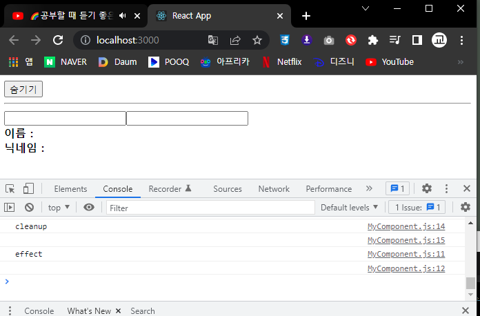

# 5. ref: DOM에 이름 달기

<br/>

* HTML에서는 DOM요소에 이름을 달 때 id를 사용하듯이 리액트는 프로젝트 내부에서 DOM에 이름을 다는 방법이 따로 있다 이를 ref(reference)라고 한다

<br/>

* 주의사항 : 리액트에서도 id를 사용할수 있지만 사용을 권장하지 않는다 많은 컴포넌트를 관리할때 id는 html내부에 유일해야 하지만 중복되는 경우가 생길수도 있기 때문이다 ref는 전역으로 작동하지 않고 컴포넌트 내부에서만 작동하기 때문에 이러한 문제가 생기지 않는다.

<br/>

## 5-1. ref는 어떤 상황에서 사용해야 할까?

<br/>


### 1. ref는 DOM을 꼭 직접적으로 건드려야 할때 사용한다.

<br>

1. 특정 input에 포커스 추가
2. 스크롤 박스 조작하기
3. canvas 요소에 그림 그리기 등

<br/>

## 5-2. useRef 사용

1. useRef를 만들려면 우선 컴포넌트 내부에서 맴버변수로 React.useRef()를 담아준뒤 해당 맴버변수 를 ref를 달고자 하는 요소에 ref props로 넣어주면 된다.

```js
//멤버변수 useRef에 담아 생성
const ref = React.useRef();
//요소에 props값으로 넣어주기
<input ref={ref}/>
```

## 5-3. useRef 실습

```js
//App.js
import React from 'react';
import MyComponent from './component/MyComponent';

function App() {

return (
    <div>
      <MyComponent/>
    </div>
);
}

export default App;

//컴포넌트 ref를 사용하여 input에 focus주기
import React,{useState} from 'react';
import styled from 'styled-components';

const MyComponentCss = styled.div`
    .success {
        background-color: lightgreen;
    }
    .failure {
        background-color: lightcoral;
    }
`;

const MyComponent = () => {

    //상태값 설정
    const [password,setPassword] = React.useState('')
    const [clicked,setClicked] = React.useState(false)
    const [validated,setValidated] = React.useState(false)

    const input =React.useRef();

    const handleChange = (e) => {
        setPassword(e.target.value)

    };
    const handleButtonClick = () => {
        setClicked(true);
        setValidated(password === '0000');
        input.current.focus();
    }
    return (
        <MyComponentCss>
            <input
            type='password'
            ref={input}
            value={password}
            onChange={handleChange}
            className={clicked ? (validated ? 'success' : 'failure') : ''}
            />
            <button onClick={handleButtonClick}>검증하기</button>
        </MyComponentCss>
    );
};


export default MyComponent;
```


<br/>

## 5-4. 자식 컴포넌트에게 ref값을 props로 전달하기

1. 컴포넌트에도 ref를 달수 있다 주로 컴포넌트 내부에 있는 DOM을 컴포넌트 외부에서 사용할때 쓴다.

2. 만약 부모 컴포넌트에서 자식컴포넌트에게 ref를 props값으로 주었다면 자식 컴포넌트에서는 props를 받을때 일반형식으로 받는것이 아닌 <b>`(React.forwardRef((props,ref)=> {})`</b>로 받아야 한다.

<br/>

### 실습

```js
//부모에서 생성한 ref를 props로 자식에게 주어 제어할때 App.js
import React from 'react';
import MyComponent from './component/MyComponent';

function App() {

return (
    <div>
      <MyComponent ref={scrollBoxRef}/>
      <button onClick={()=> {
        const {scrollHeight,clientHeight} = scrollBoxRef.current;
        scrollBoxRef.current.scrollTop = scrollHeight - clientHeight;
      }}>맨 밑으로</button>
    </div>
);
}

export default App;

//부모에서 생성한 ref를 props로 자식에게 주어 제어할때 컴포넌트
import React,{useState} from 'react';

const MyComponent = React.forwardRef((props,ref) => {

    const style = {
        border: '1px solid black',
        height: '300px',
        width: '300px',
        overflow: 'auto',
        position: 'relative',
    };
    const innerStyle = {
        width: '100%',
        height: '650px',
        background: 'linear-gradient(white, black)'
    }

    return (
        <div
        style={style}
        ref={ref}>
            <div style={innerStyle}></div>
        </div>
    );
});


export default MyComponent;
```


<br/>

# 6. 컴포넌트 반복

* 코드의 반복을 줄여 효율적으로 리액트를 사용하는 방법

<br>

## 6-1. 데이터 배열 컴포넌트 배열로 변환하기

1. map 함수를 사용하여 컴포넌트에 반복되는 구문 줄이기

```js
//컴포넌트 반복문 App.js
import React from 'react';
import MyComponent from './component/MyComponent';

function App() {

return (
    <div>
      <MyComponent/>
    </div>
);
}

export default App;

//컴포넌트 반복 (컴포넌트) key값을 주지 않았을때
import React from 'react';


const MyComponent = () => {

    const names = ['눈사람','얼음','눈','바람'];
    const nameList = names.map(v => <li>{v}</li>)
    return <ul>{nameList}</ul>
};


export default MyComponent;
```


<br>

## 6-2. key

1. 6-1의 실행결과를 보면 알수 있듯이 개발자 도구 console에 'key' prop이 없다는 경고메세지 를 볼수 있다
2. 리액트에서 key는 컴포넌트 배열을 랜더링 했을 때 어떤 원소에 변동이 있었는지 알아내려 사용한다
3. 리액트의 Virtual DOM 을 비교하는 과정에서 리스트를 순차적으로 비교하면서 변화를 감지하기에 key가 없다면 어떤 변화가 일어났는지 빠르게 알아낼수 없다.
4. key 값은 언제나 유일해야 한다 따라서 데이터가 가진 고윳값을 key값으로 설정해야 한다
5. map 함수를 사용할 때는 콜백 함수의 인수인 index 값을 사용하여 key 값을 적용한다

```js
//컴포넌트 반복 (컴포넌트) key값을 주었을때
import React from 'react';


const MyComponent = () => {

    const names = ['눈사람','얼음','눈','바람'];
    const nameList = names.map((v,i) => <li key={i}>{v}</li>)
    return <ul>{nameList}</ul>
};

export default MyComponent;
```


<br>

## 6-3. 응용

1. input의 value를 항목에 추가하는 기능
* 상태 안에서 배열을 변형할 때는 배열에 직접 전근이 아닌 concat,filter등의 배열 내장 함수를 사용하여 새로운 배열을 만든 후 새로운 상태로 설정해 주어야 한다.

```js
//input의 값을 데이터에 추가하기
import React,{useState} from 'react';


const MyComponent = () => {

    const [names,setNames] = useState([
        {id: 1, text: '눈사람'},
        {id: 2, text: '얼음'},
        {id: 3, text: '눈'},
        {id: 4, text: '바람'},
    ]);

    const [inputText,setInputText] = useState('');
    const [nextId,setNextId] = useState(5);

    const onChange = e => setInputText(e.target.value);
    const onClick = e => {
        const nextNames = names.concat({
            id: nextId,
            text: inputText
        });
        setNextId(nextId + 1);
        setNames(nextNames);
        setInputText('');
    };
    const nameList = names.map(name => <li key={name.id}>{name.text}</li>);
    
    return (
        <div>
            <input value={inputText} onChange={onChange}/>
            <button onClick={onClick}>추가</button>
            <ul>{nameList}</ul>
        </div>
    )
};


export default MyComponent;
```


<br>

2. 데이터제거 기능 구현
* 상태 안에서 배열을 변형할 때는 배열에 직접 전근이 아닌 concat,filter등의 배열 내장 함수를 사용하여 새로운 배열을 만든 후 새로운 상태로 설정해 주어야 한다.

```js
//값을 더블클릭하여 삭제하기
import React,{useState} from 'react';


const MyComponent = () => {

    const [names,setNames] = useState([
        {id: 1, text: '눈사람'},
        {id: 2, text: '얼음'},
        {id: 3, text: '눈'},
        {id: 4, text: '바람'},
    ]);

    const [inputText,setInputText] = useState('');
    const [nextId,setNextId] = useState(5);

    const onChange = e => setInputText(e.target.value);
    const onClick = e => {
        const nextNames = names.concat({
            id: nextId,
            text: inputText
        });
        setNextId(nextId + 1);
        setNames(nextNames);
        setInputText('');
    };
    const onRemove = id => {
        const nextNames = names.filter(name => name.id !== id);
        setNames(nextNames);
    };
    
    const nameList = names.map(name => <li key={name.id} onDoubleClick={()=> onRemove(name.id)}>{name.text}</li>);
    
    return (
        <div>
            <input value={inputText} onChange={onChange}/>
            <button onClick={onClick}>추가</button>
            <ul>{nameList}</ul>
        </div>
    )
};


export default MyComponent;
```


<br>

# 7. Hooks

* Hooks는 리액트 v16.8에 새로 도입된 기능으로 함수 컴포넌트에서도 상태 관리를 할 수 있는 useState 랜더링 직후 작업을 설정하는 useEffect등의 기능을 제공하여 기존의 함수 컴포넌트에서 할 수 없었던 다양한 작업을 할수 있게 해 준다
<br>

## 7-1. useState

* useState는 가장 기본적인 Hook이며, 함수 컴포넌트에서도 가변적인 상태를 지닐수 있게 해준다.

* const [상태변수,상태변수의 값을 갱신하기 위한 함수(setter)] = useState(초기값)

* 상태변수를 변환하기 위해서는 상태변수를 직접적으로 바꾸지 않고 상태변수의 값을 갱신하기 위한 함수를 호출하여 값을 변경한다.

* useState는 컴포넌트 에서 여러번 사용해도 무관하다.

```js
//useState App.js
import React from 'react';
import MyComponent from './component/MyComponent';

function App() {

return (
    <div>
      <MyComponent/>
    </div>
);
}

export default App;

//useState를 한번만 사용한 컴포넌트
import React,{useState} from 'react';

const MyComponent = () => {

    const [value,setValue] = useState(0);
    return (
        <div>
            <p>현재 카운터 값은 <b>{value}</b>입니다.</p>
        </div>
        <button onClick={()=> setValue(value+1)}>+1</button>
        <button onClick={()=> setValue(value-1)}>-1</button>
    )
};

export default MyComponent;
```


<br>

```js
//useState 를 여러번 사용한 컴포넌트
import React,{useState} from 'react';


const MyComponent = () => {

    const [name,setName]= useState('');
    const [nickname,setNickname]= useState('');

    const onChangeName = e => {
        setName(e.target.value);
    }
    const onChangeNickname = e => {
        setNickname(e.target.value);
    }
    return (
        <div>
            <div>
                <input value={name} onChange={onChangeName}/>
                <input value={nickname} onChange={onChangeNickname}/>
            </div>

            <div>
                <div>
                    <b>이름 :</b> {name}
                </div>
                <div>
                    <b>닉네임 :</b>{nickname}
                </div>
            </div>
        </div>
    )
};


export default MyComponent;
```


<br>

## 7-2. useEffect

* useEffect는 리액트 컴포넌트가 랜더링될 때마다 특정 작업을 수행하도록 설정할 수 있는 Hook이다

```js
//useEffect App.js
import React from 'react';
import MyComponent from './component/MyComponent';

function App() {

return (
    <div>
      <MyComponent/>
    </div>
);
}

export default App;

//useEffect 컴포넌트
import React,{useState,useEffect} from 'react';


const MyComponent = () => {

    const [name,setName]= useState('');
    const [nickname,setNickname]= useState('');

    useEffect(()=> {
        console.log ('랜더링 완료')
        console.log ({
            name,
            nickname
        });
    });
    const onChangeName = e => {
        setName(e.target.value);
    }
    const onChangeNickname = e => {
        setNickname(e.target.value);
    }
    return (
        <div>
            <div>
                <input value={name} onChange={onChangeName}/>
                <input value={nickname} onChange={onChangeNickname}/>
            </div>

            <div>
                <div>
                    <b>이름 :</b> {name}
                </div>
                <div>
                    <b>닉네임 :</b>{nickname}
                </div>
            </div>
        </div>
    )
};


export default MyComponent;
```


<br>

* 마운트될 때만 실행하고 싶을때

```js
    useEffect(()=> {
        console.log ('랜더링 완료')
    },[]);
```


<br>

* 특정 값이 업데이트 될때만 실행하고 싶을때

```js
    useEffect(()=> {
        console.log ('랜더링 완료')
    },[name]);
```


<br>

### 7-2-1. 언마운트시 useEffect제어

```js
//useEffect 언마운트시 제어하기 App.js
import React from 'react';
import MyComponent from './component/MyComponent';

function App() {

const [visible,setVisible] = React.useState(false);
return (
    <div>
      <button
      onClick={()=>{
        setVisible(!visible);
      }}>
        {visible ? '숨기기' : '보이기'}
      </button>
      <hr/>
      {visible && <MyComponent/>}
    </div>
);
}

export default App;

//useEffect 언마운트시 제어하기 컴포넌트
import React,{useState,useEffect} from 'react';


const MyComponent = () => {

    const [name,setName]= useState('');
    const [nickname,setNickname]= useState('');

    useEffect(()=> {
        console.log ('effect')
        console.log (name);
        return () => {
            console.log ('cleanup')
            console.log (name);
        }
    },[name]);
    const onChangeName = e => {
        setName(e.target.value);
    }
    const onChangeNickname = e => {
        setNickname(e.target.value);
    }
    return (
        <div>
            <div>
                <input value={name} onChange={onChangeName}/>
                <input value={nickname} onChange={onChangeNickname}/>
            </div>

            <div>
                <div>
                    <b>이름 :</b> {name}
                </div>
                <div>
                    <b>닉네임 :</b>{nickname}
                </div>
            </div>
        </div>
    )
};


export default MyComponent;
```




<br>

## 7-3. useReducer

* useReducer는 useState보다 더 다양한 컴포넌트 상황에 따라 다양한 상태를 다른 값으로 업데이트해 주고 싶을 때 사용하는 Hook이다

* useReducer는 현재상태 그리고 업데이트를 위해 필요한 정보를 담은 액션(action) 값을 전달 받아 새로운 상태를 반환하는 함수 이다, useReducer함수 에서 새로운 상태를 만들때는 반드시 불변성을 지켜주어야 한다.

* useReducer의 첫 번째 파라미터에는 리듀서 함수를 넣고, 두번째 파라미터에는 해당 리듀서의 기본값을 넣어준다

* 상태값을 갱신하기 위한 함수를 호출하여 값을 넣어주면 그 값이 첫번째 파라미터인 함수로 넘어가고 함수에서 값을 변환하여 상태값에 넣어준다.
  
```js
//useReducer App.js
import React from 'react';
import MyComponent from './component/MyComponent';

function App() {

return (
    <div>
      <MyComponent/>
    </div>
);
}

export default App;

//useReducer 컴포넌트
import React,{useState,useReducer} from 'react';


function reducer(state,action) {
    switch (action.type) {
        case 'INCREMENT' :
            return {value: state.value + 1};
        case 'DECREMENT' :
            return {value: state.value -1}
        default :
            return state;
    }
}

const MyComponent = () => {

    const [state,dispatch] = useReducer(reducer,{value: 0});
    return (
        <div>
            <p>현재 카운터 값은 <b>{state.value}</b>입니다.</p>
            <button onClick={()=> dispatch({type:'INCREMENT'})}>+1</button>
            <button onClick={()=> dispatch({type:'DECREMENT'})}>-1</button>
        </div>
    )
};

export default MyComponent;
```


<br>

### 7-3-1. 인풋 상태 관리하기

```js
//useReducer 컴포넌트/ input관리
import React,{useState,useReducer} from 'react';

function reducer(state,action) {
    return {
        ...state,
        [action.name]:action.value,
    };
}

const MyComponent = () => {

    const [state,dispatch] = useReducer(reducer,{
        name:'',
        nickname:'',
    });
    const {name,nickname} = state;
    const onChange =e => {
        dispatch(e.target)
    };
    return (
        <div>
            <input name='name' value={name} onChange={onChange}/>
            <input name='nickname' value={nickname} onChange={onChange}/>
        <div>
            <div>
                <b>이름 :</b>{name}
            </div>
            <div>
                <b>닉네임 :</b>{nickname}
            </div>
        </div>
        </div>
    )
};

export default MyComponent;
```


<br>


## 7-4. useMemo

* useMemo를 사용하면 함수 컴포넌트 내부에서 발생하는 연산을 최적화 할수 있다.

* 랜더링 과정에서 특정 값이 바뀌었을 때만 연산을 실행하고 원하는 값이 바뀌지 않았다면 이전에 연산했던 결과를 다시 사용하는 방식이다.

```js
//useMemo App.js
import React from 'react';
import MyComponent from './component/MyComponent';

function App() {

return (
    <div>
      <MyComponent/>
    </div>
);
}

export default App;

//useMemo를 사용하지 않은 컴포넌트
import React,{useState,useReducer} from 'react';

const getAverage = numbers => {
    console.log ('평균값 계산 중...');
    if (numbers.length === 0) return 0;
    const sum = numbers.reduce((a,b)=> a+b);
    return sum / numbers.length;
};

const MyComponent = () => {
    const [list,setList]= useState([]);
    const [number,setNumber]= useState('');

    const onChange = e => {
        setNumber(e.target.value);
    }
    const onInsert = e => {
        const nextList = list.concat(parseInt(number));
        setList(nextList);
        setNumber('');
    }

    return (
        <div>
            <input value={number} onChange={onChange}/>
            <button onClick={onInsert}>등록</button>
            <ul>
                {list.map((value,index)=> (
                    <li key={index}>{value}</li>
                ))}
            </ul>
            <div>
                <b>평균값:</b>{getAverage(list)}
            </div>
        </div>
    );
};

export default MyComponent;

//useMemo를 사용하여 랜더링 계산절약하기
import React,{useState,useMemo} from 'react';

const getAverage = numbers => {
    console.log ('평균값 계산 중...');
    if (numbers.length === 0) return 0;
    const sum = numbers.reduce((a,b)=> a+b);
    return sum / numbers.length;
};

const MyComponent = () => {
    const [list,setList]= useState([]);
    const [number,setNumber]= useState('');

    const onChange = e => {
        setNumber(e.target.value);
    }
    const onInsert = e => {
        const nextList = list.concat(parseInt(number));
        setList(nextList);
        setNumber('');
    }

    const avg = useMemo(() => getAverage(list),[list])
    return (
        <div>
            <input value={number} onChange={onChange}/>
            <button onClick={onInsert}>등록</button>
            <ul>
                {list.map((value,index)=> (
                    <li key={index}>{value}</li>
                ))}
            </ul>
            <div>
                <b>평균값:</b>{avg}
            </div>
        </div>
    );
};

export default MyComponent;
```


<br>

## 7-5. useCallback

* useCallback은 useMemo와 상당히 비슷한 함수이다

* 주로 랜더링 성능을 최적화해야 하는 상황에서 사용하는데요 이 Hook을 사용하면 만들어 놧던 함수를 재사용할수 있다

* 컴포넌트의 랜더링이 자주 발생하거나 랜더링해야 할 컴포넌트의 개수가 많아지면 이부분을 최적화해 주는것이 좋다

* useCallback의 파라미터는 첫번째로 함수가 들어가고 두번째로 배열이 들어간다 이배열에는 어떤 값이 바뀌었을때 함수를 생성해야 하는지 명시해야 한다.
  * 비어 있는 배열을 넣게 되면 컴포넌트가 랜더링될 때 만들었던 함수를 계속해서 재사용하게 되며 상태값을 넣었을때는 해당 항목에 변화가 있을때 함수를 사용하게 된다
  * 함수 내부에서 상태 값에 의존해야 할때는 그 값을 반드시 두번째 파라미터 안에 포함시켜 주어야 한다

```js
//useCallback App.js
import React from 'react';
import MyComponent from './component/MyComponent';

function App() {

return (
    <div>
      <MyComponent/>
    </div>
);
}

export default App;

//useCallback 컴포넌트
import React,{useState,useMemo,useCallback} from 'react';

const getAverage = numbers => {
    console.log ('평균값 계산 중...');
    if (numbers.length === 0) return 0;
    const sum = numbers.reduce((a,b)=> a+b);
    return sum / numbers.length;
};

const MyComponent = () => {
    const [list,setList]= useState([]);
    const [number,setNumber]= useState('');

    const onChange = useCallback(e => {
        setNumber(e.target.value);
    },[]);
    const onInsert = useCallback(e => {
        const nextList = list.concat(parseInt(number));
        setList(nextList);
        setNumber('');
    },[number,list]);

    const avg = useMemo(() => getAverage(list),[list])
    return (
        <div>
            <input value={number} onChange={onChange}/>
            <button onClick={onInsert}>등록</button>
            <ul>
                {list.map((value,index)=> (
                    <li key={index}>{value}</li>
                ))}
            </ul>
            <div>
                <b>평균값:</b>{avg}
            </div>
        </div>
    );
};
```
<br>

## 7-6. useRef

* useRef를 활용하여 input에 focus주기 실습

```js
//useRef App.js
import React from 'react';
import MyComponent from './component/MyComponent';

function App() {

return (
    <div>
      <MyComponent/>
    </div>
);
}

export default App;

//useRef 컴포넌트/focus
import React,{useState,useMemo,useCallback,useRef} from 'react';

const getAverage = numbers => {
    console.log ('평균값 계산 중...');
    if (numbers.length === 0) return 0;
    const sum = numbers.reduce((a,b)=> a+b);
    return sum / numbers.length;
};

const MyComponent = () => {
    const [list,setList]= useState([]);
    const [number,setNumber]= useState('');
    const inputEl = useRef(null);

    const onChange = useCallback(e => {
        setNumber(e.target.value);
    },[]);
    const onInsert = useCallback(e => {
        const nextList = list.concat(parseInt(number));
        setList(nextList);
        setNumber('');
        inputEl.current.focus();
    },[number,list]);

    const avg = useMemo(() => getAverage(list),[list])
    return (
        <div>
            <input value={number} onChange={onChange} ref={inputEl}/>
            <button onClick={onInsert}>등록</button>
            <ul>
                {list.map((value,index)=> (
                    <li key={index}>{value}</li>
                ))}
            </ul>
            <div>
                <b>평균값:</b>{avg}
            </div>
        </div>
    );
};

export default MyComponent;
```

<br>

## 7-7. 커스텀 Hooks

* 여러 컴포넌트에서 비슷한 기능을 공유할 경우 이를 본인만의 Hook으로 작성하여 로직을 재사용할수 있다.

* 해당 컴포넌트는 MyComponent 에서 useInputs를 import하여 상태값과 초기값을 설정해주었고 onChange되어 함수가 발동하면 dispatch를 호출하여 input태그의 값을 useReducer의 첫번째 파라미터 함수에게 전달해준다 전달된 값은 상태값(state)를 변경하고 리턴되어 반환된다. 반환된 값은 다시 MyComponent로 리턴되고 비구조 문법을 거쳐 input의 value가 된다

```js
//커스텀 hook App.js
import React from 'react';
import MyComponent from './component/MyComponent';

function App() {

return (
    <div>
      <MyComponent/>
    </div>
);
}

export default App;

//커스텀 hook 컴포넌트 (useInputs.js)
import {useReducer} from 'react';

function reducer(state,action) {
    return {
        ...state,
        [action.name] : action.value
    };
}

export default function useInputs(initialForm) {
    const [state,dispatch] = useReducer(reducer,initialForm);
    const onChange = e => {
        dispatch(e.target);
    };
    return [state,onChange];
}

//커스텀 hook 컴포넌트 (MyComponents)
import React,{useState,useMemo,useCallback,useRef} from 'react';
import useInputs from './useInputs';


const MyComponent = () => {

    const [state,onChange] = useInputs({
        name:'',
        nickname:'',
    });
    const {name,nickname} = state;


    return (
        <div>
            <div>
                <input name='name' value={name} onChange={onChange}/>
                <input name='nickname' value={nickname} onChange={onChange}/>
            </div>
            <div>
                <div>
                    <b>이름:</b>{name}
                </div>
                <div>
                    <b>닉네임:</b>{nickname}
                </div>
            </div>
        </div>
    );
};

export default MyComponent;
```


<br>


