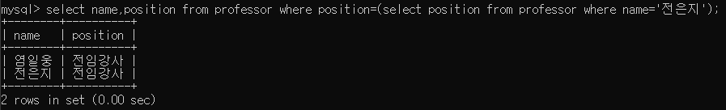
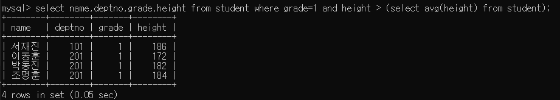
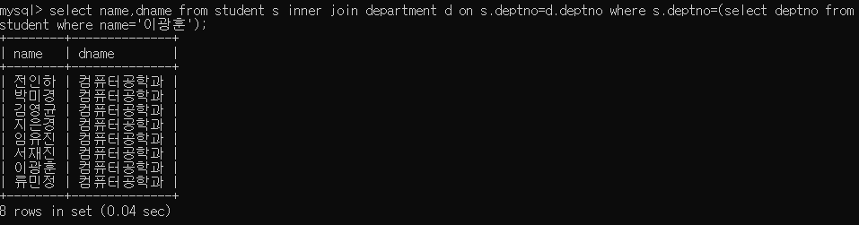
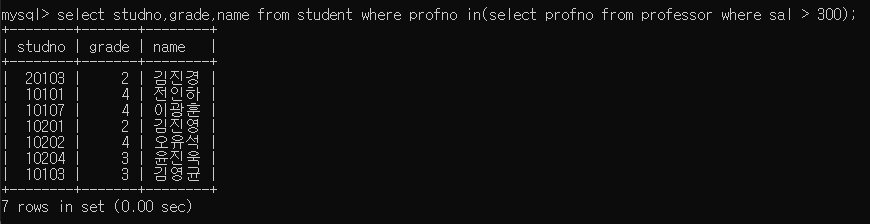

# SubQuery

##  SQL 안의 SQL

1. 하나의 sql 명령문의 처리결과를 다른 sql 명령문에 전달하기 위해 두개이상의 sql문을 하나의 sql문으로 연결한 형태
2. 검색조건을 다른 결과 집합에서 찾기 위해서 사용한다
3. 서브쿼리를 포함한 sql문을 `메인쿼리`라고 한다
4. 서브쿼리는 select 문의 시작과 끝에 `()`를 묶어서 메인쿼리와 구분한다.
> select *| 컬럼 ...from 테이블 where 컬럼 연산자 (select...)

|종류|설명|
|---|---|
|단일 행 서브쿼리|단 하나의 검색 결과만을 반환하는 형태 서브쿼리를 검색결과로 사용하기 위해 비교연산자가 사용된다|
|다중 행 서브쿼리|하나 이상의 검색결과를 반환하는 형태 서브쿼리를 검색결과로 사용하기 위해 `in`연산자가 사용된다|
|||

### 단일 행 서브쿼리(1)

### 단일 행 서브쿼리(2)

### 단일 행 서브쿼리(3)

### 다중행 서브쿼리(1)

# 입력,수정,삭제

## insert절

1. 테이블에 데이터를 추가하기 위한 구문
> insert into <테이블이름> values (값1,값2,...,값n);
2. 값을 명시하는 방법
   1. 숫자형식의 데이터는 홑따음표를 사용하지 않는다.
   2. 그 밖의 형식 (문자열,날짜형식)값은 홑따음표로 감싼다.
   3. 값을 나열할 때는 테이블 구조에서 정의하고 있는 컬럼의 순서에 맞게 명시해야 한다.

### 데이터 추가

### 데이터 추가 후 조회

### 컬럼명을 명시한 데이터 저장
>insert into <테이블이름> (컬럼1,컬럼2,...,컬럼n) values (값1,값2,...값n)

>나열되는 컬럼의 이름이 테이블 구조에서 정의하고 있는 컬럼순서와 일치할 필요는 없다.

>테이블 이름 뒤에 명시되는 컬럼의 순서나 갯수는 values 뒤에 나열되는 값과 일치하여야 한다.

### 컬럼명을 명시한 데이터 저장후 조회

### 테이블의 구조를 통한 null 데이터 저장 가능 여부의 확인

> desc 구문을 사용하여 테이블 구조를 조회 했을때 null 항목에 yes라고 표시되는 컬럼은 null값을 허용한다.

>즉, 아래의 테이블 구조에서 deptno,dname은 필수 입력항목이고, loc 컬럼은 미필수 입력항목이 된다.

### null 데이터를 입력하기 위한 암묵적인 방법

> insert into 절에서 해당 컬럼의 이름과 값을 생략한다

### null 데이터를 입력하기 위한 명시적인 방법

> values 절의 컬럼값에 null을 사용한다

 

### 날짜 데이터 입력 방법(1)

> 컬럼에 날짜를 입력하면 'yyyy-mm-dd hh:mi:ss'혹은 'yyyy-mm-dd'형식에 따른 날짜 데이터를 입력하여야 한다

 

### 날짜 데이터 입력 방법(2)

> 자동으로 현재 날짜로 입력하기 위해서는 `now()`함수를 사용한다

 

### 중복데이터 방지하기(1)

>테이블에 중복되는 데이터가 저장되어 있다면 하나를 뺀 나머지 데이터들은 불필요한 값으로 시스템의 자원을 낭비하게 된다

> 때문에 각 데이터는 중복되지 않기 위한 최소한의 제약을 요구한다

>이를 위해 '테이블의 각 행을 고유하게 식별하는 값'을 가진 열(또는 열 조합)을 기본키(primary key)라고 한다

### 중복데이터 방지하기(2)

>데이터베이스 테이블의 컬럼에 기본키(primary key)옵션을 지정하여 중복 데이터의 입력을 방지할 수 있다.

1. 기본키로 설정된 컬럼은 각 데이터 행의 구분을 위해 고유한 값만을 저장해야 하기 때문에 다른 행과 중복된 값을 저장할 수 없도록 제약된다.
2. 기본키는 일반적으로 일련번호의 개념으로 사용되는데,데이터를 저장할 때마다 중복되지 않는 일련번호를 계산하기 어려우므로 auto_increment 옵션을 사용하여 데이터 저장시 시스템에서 자동으로 일련번호를 생성하도록 할수 있다.
   1. 이속성이 설정된 경우 insert 절에서 해당 컬럼을 명시하지 않아도 자동으로 기존의 값들중 가장 큰 값 보다 1 큰 값이 저장되어, 데이터의 고유성을 유지하게 된다.

### 중복데이터 방지하기(3)

1. primary key 속성이 설정된 컬럼에 저장되는 값이 기존에 저장된 데이터와 중복될 경우 에러가 발생한다.
2. 데이터가 중복되지 않는다는 특성을 `데이터 무결성`이라고 한다
3. 기본키 제약조건을 다른 말로 데이터 `무결성 제약조건`이라 한다.

## 데이터 수정

> update <테이블이름> set 컬럼1=값1,컬럼2=값2,...,컬럼n=값n [where 검색조건];

>where 절을 사용하지 않은 경우 모든 데이터가 같은 값으로 수정되기 때문에 사용에 주의가 필요하다.

### 데이터수정 실행결과

## 데이터 삭제

> delete from <테이블이름> [where 검색조건];

> where 절을 사용하지 않는 경우 모든데이터가 삭제되므로 사용에 주의가 필요하다.

### 데이터 삭제 실행결과

## 데이터 입력,수정,삭제 (함수의 사용)

1. 데이터 입력시 : 저장할 값을 함수를 사용하여 명시한다
   1. insert into <테이블이름> values (함수이름(값),함수이름(값)...);
2. 데이터 수정시 : 수정될 값에 함수를 적용할수 있다
   1. update <테이블이름> set 컬럼이름=함수이름(값),컬럼이름=함수이름(값) [where 함수가 적용된 검색조건]
3. 데이터 삭제시 : 삭제될 대상을 지정하는 where 절에서 사용할수 있다
   1. delete from <테이블이름> [where 함수가 적용된 검색조건]

### 실행결과

