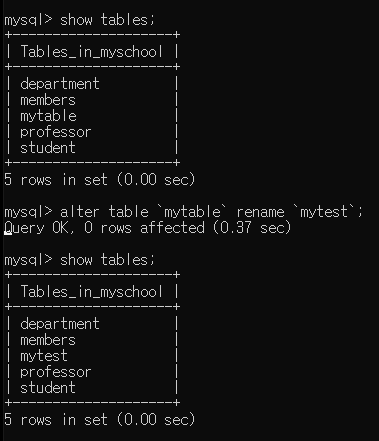
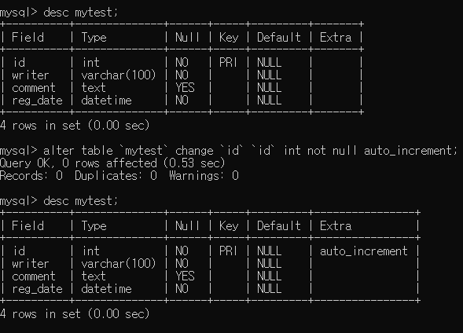
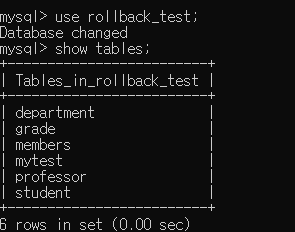

# 데이터베이스 관리(1)

<br>

## 1. 데이터베이스 생성/삭제

<br>

### 1-1. 데이터베이스 생성

>기존에 존재하는 데이터 베이스와 동일한 이름의 데이터베이스는 생성할 수 없다.

>기본 케릭터 셋은 utf8,euckr 등의 값을 지정할수 있다 (euckr의 경우 데이터베이스에서 백엔드로 데이터가 넘어갈땐 괜찮지만 백엔드에서 프론트로 넘어갈때 데이터가 깨질수 있다 그러므로 utf8을 씀)

```js
//사용방법
create database `데이터베이스이름` [default charset `utf8`]; 
```

<br>

### 1-2. 데이터베이스 삭제

>존재하지 않는 데이터베이스의 이름을 지정한 경우 에러가 발생

>삭제한 데이터베이스는 복구할 수 없기 때문에 신중히 수행해야 한다

```js
//사용방법
drop database `데이터베이스이름`;
```

<br>

### 1-3 데이터베이스 생성/삭제 실행결과

#### 데이터베이스 생성 실행결과
<br>
#### 데이터베이스 삭제 실행결과


<br>

## 2. 테이블 생성

> ENGINE=InnoDB : oracle이 mysql을 인수한 후에 추가한 저장형식으로 참조키나 프로시저 등의 고급기능을 사용할 수 있게 한다.

> default charset=`utf8` : 기본 문자열 저장 형식을 utf8로 설정한다

> 테이블 이름이나 컬럼이름에 경우 역따음표(백틱)을 적용한다

> comment는 홑따음표를 적용한다

```js
//사용방법
create table `테이블이름` (`컬럼이름` 데이터타입 [not null | null] [auto_increment] [comment'컬럼설명'],`컬럼이름` 데이터타입 [not null | null] [auto_increment] [comment'컬럼설명'],[primary key (`기본키컬럼이름`)]) ENGINE=InnoDB DEFAULT CHARSET=`utf8` comment='테이블 설명';
```

<br>

### 2-1 데이터 타입

|구분|데이터타입|설명|
|---|---|---|
|문자,문장형|char(n)|글자수가 최대 n개인 고정 길이 문자열 저장(한글,영문 구분없이 한글자로 취급)<br>ex) char(10)의 설정되있을때 'aaaaa' 5글자를 입력하면 나머지5글자는 공백처리되어 10글자에 맞춰 저장된다 초과시 설정되어 있는 글자수를 제외한 데이터는 저장하지 않는다<br>우편번호,주민번호 등과 같이 고정된 데이터에 사용한다|
|문자,문장형|varchar(n)|글자수가 최대 n개인 가변 길이 문자열 저장<br>아이디,이메일주소,비밀번호,글제목 등 글자수가 불규칙 적인 데이터에 적용|
|문자,문장형|text|최대 65535 길이의 문자열을 저장한다 (게시판 본문등)
|숫자형|tinyint<br>smallint<br>int(기본)<br>bigint|정수 형태의 데이터를 저장한다<br>tinyint>smallint>int>bigint|
|숫자형|float(m,n)|실수형태의 데이터를 저장한다<br>m은 전체 자리수(소수점도 자리수에 포함),n은 소수점 이하의 자리수<br>ex)float(5,1)의 경우 xxx.x의 소수점 자리를 float(9.2)의 경우 xxxxxx.xx을 뜻한다|
|날짜형|date|날짜 형식의 데이터를 저장한다 (yyyy-mm-dd)|
|날짜형|datetime|날짜+시간 형식의 데이터를 저장한다 (yyyy-mm-dd hh:mi:ss)|
|기타|blob|최대 65535 길이의 바이너리를 저장한다 (2진수형태 utf8 환경에서 text보다 권장한다)<br>게시판 본문등에 사용|
|기타|enum('a','b',...,'z')|저장 가능한 값을 a,b,c,...z로 제한한다<br>성별 : enum('f','m') ,수신동의 : enum('y','n')|
|||

<br>

### 2-2. 테이블 생성

>데이터 타입을 결정한 후에는 null 데이터의 허용 여부를 명시한다 null : null 데이터 허용(미필수 입력 항목) , not null : null 데이터 사용 불가(필수 입력 항목)

>기본키(primary key) 지정 방법은 2가지로 컬럼을 작성하며 해당줄에 작성하는 방법과 컬럼들을 다 작성한 뒤 마지막에 primary key를 지정해주는 방법이 있다

>자동증가 일련번호의 설정 :각 데이터 행을 고유하게 구분하기 위해 설정하는 primary key가 int 형인 경우 auto_increment 옵션을 추가하면 데이터 insert시에 자동으로 1씩 증가된 값이 저장된다.

```js
//컬럼을 나열할때 primary key를 명시한 경우
create table <테이블이름> (`컬럼이름` int not null primary key auto_increment comment '컬럼설명',`컬럼이름` varchar(10) not null comment '컬럼설명') ENGINE=InnoDB DEFAULT CHARSET=`utf8` comment='테이블설명';

//마지막에 primary key를 명시한 경우
create table <테이블이름> (`컬럼이름` int not null auto_increment comment '컬럼설명',`컬럼이름` varchar(10) not null comment '컬럼설명',primary(`적용할 컬럼이름`)) ENGINE=InnoDB DEFAULT CHARSET=`utf8` comment='테이블설명';
```

<br>

#### 테이블 생성 실행결과


<br>

### 2-3. 테이블 삭제

>존재하지 않는 테이블을 삭제할 경우 에러가 발생한다

>삭제된 테이블은 복구 할 수 없으므로,주의가 필요하다

```js
//사용방법
drop table `테이블이름`;
```

<br>

#### 테이블 삭제 실행결과


# 데이터 베이스 관리(2)

## 1. 테이블 수정하기

### 1-1. 테이블 구조 변경하기

> alter table `테이블이름` 명령어;

### 1-2. 명령어 종류

|명령어|설명|
|---|---|
|rename|테이블의 이름을 변경한다|
|add|컬럼이나 제약조건을 추가한다|
|change|컬럼을 수정한다|
|drop|컬럼이나 제약조건을 삭제한다|
|||

### 1-3. 테이블 이름 변경

```js
//사용방법
alter table `테이블이름` rename `새로운 테이블이름`;
```

`실행결과`




### 1-4. 테이블 컬럼 추가(1)

```js
//사용방법
alter table `테이블이름` add `추가할 컬럼 이름` datetime not null;
```

`실행결과`


### 1-5. 테이블 컬럼 추가(2)

>add 명령어와 after 옵션을 사용하여 특정 컬럼 뒤에 새로운 컬럼 추가

```js
//사용방법
alter table `테이블이름` add `추가할 컬럼 이름` varchar(50) null after `기준이 될 컬럼`;
```

`실행결과`


### 1-6. 테이블 컬럼 수정(1)

```js
//사용방법
alter table `테이블이름` change `컬럼이름` `새로운컬럼이름` text null;
```

`실행결과`


### 1-7. 테이블 컬럼 수정(2)

>기존 컬럼 이름을 유지하고 데이터 타입만 변경하는 방법

```js
//사용방법
alter table `테이블이름` change `컬럼이름` `컬럼이름` varchar(100) not null;
```

`실행결과`


### 1-8. 테이블 컬럼 삭제

```js
//사용방법
alter table `테이블이름` drop `컬럼이름`;
```

`실행결과`


### 1-9 테이블 기본키(primary key) 속성 해제

```js
//auto_increment 해제 사용방법
alter table `테이블이름` change `기본키컬럼` `기본키컬럼` int not null;

//primary key 해제 사용방법
alter table `테이블이름` drop primary key;
```

`auto_increment 해제 실행결과`


`primary key 해제 실행결과`


### 1-10. 테이블 기본키(primary key,auto_increment) 추가

```js
//primary key 추가 사용방법
alter table `테이블이름` add primary key ('기준이될컬럼이름');

//auto_increment 추가 사용방법
alter table `테이블이름` change `컬럼이름` `컬럼이름` int not null auto_increment;
```

`primary key 추가 실행결과`


`auto_increment 추가 실행결과`



### 1-11. 테이블 참조 관계 이해

>A테이블의 컬럼1에 저장 될 데이터가 반드시 B테이블에 저장되어 있는 값중의 하나이어야 할 경우 'A테이블은 B테이블을 참조한다'라고 하며 컬럼1을 B테이블에 대한 참조키 혹은 외래키(Foreign key)라고 한다

>A테이블의 primary key를 B테이블의 Primary key가 참조하는 경우 각테이블에 고유하게 존재하는 값끼리 참조하므로 1:1관계가 성립된다

>A테이블의 primary key를 B테이블의 일반 컬럼이 참조하는 경우 하나의 A를 하나 이상의 B가 참조하는 1:n 관계가 성립된다.

1. 참조키 설정시 다음의 제약조건( `참조무결성` )이 생성된다
    1. 다른 테이블의 참조를 받고 있는 데이터는 참조하고 있는 데이터가 삭제되기 전까지는 먼저 삭제될 수 없다.
    2. 다른 테이블의 데이터를 참조하는 컬럼은 해당 컬럼의 데이터 중 하나를 저장해야만 한다.


```js
//참조키 설정하기 사용방법
create table `테이블이름` (
    `컬럼이름` 데이터타입 [not null|null] [auto_increment] [comment='컬럼설명'],
    `컬럼이름` 데이터타입 [not null|null] [auto_increment] [comment='컬럼설명'],
    [primary key (`기본키컬럼이름`)],
    [foreign key (`참조키컬럼이름`)] references `대상테이블명의 컬럼명`]
) engine=innoDB default charset=`utf8` comment='테이블설명';
```

`참조키 설정 테이블 만들기 실행결과`


`테이블 구조 실행결과`

>참조키는 테이블 구조에서 `MUL` 로 표시된다


### 1-12. 참조관계에서 insert의 제약조건 확인하기

`참조한 원본 테이블 데이터에 저장되지 않는 값을 inser한 경우 실행결과`


`참조한 원본 테이블 데이터에 저장되어 있는 값을 inser한 경우 실행결과`


### 1-13. 참조관계에서 delete의 제약조건 확인

> 다른 테이블의 참조를 받고 있는 데이터는 자신을 참조하는 대상이 삭제되기 전에는 먼저 삭제 될수 없다(참조 무결성)

## 2. 데이터 베이스 백업/복구

### 2-1 데이터베이스 백업/복구

>MySQL의 백업과 복구는 명령프롬프트에서 MySQL의 실행파일이 위치하는 경로로 이동한 후에 수행해야 한다

```js
//백업 사용방법
mysqldump -u계정아이디 -p 백업할DB이름 > 백업파일경로
//복구 사용방법
mysql -u계정아이디 -p 복구할db이름 < 백업파일경로
```

`데이터 베이스 백업 실행결과`


`데이터 베이스 복구 실행결과`

<br>
<br>
<br>
<br>