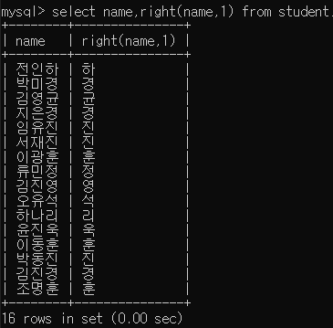

# 1. SQL 연산자

## 1-1. betWeen 연산자

> between 연산자는 특정 칼럼의 데이터 값이 하한값 a 와 상한값 b사이에 포함되는 행을 검색하기 위한 연산자 이다.

>and 연산자와 동일한 값을 줄수 있다.

> select 컬럼이름 from <테이블이름> where 컬럼이름 between a and b;

### between 연산자 실행결과

### and 연산자 실행결과

## 1-2. in 연산자

> in 연산자는 특정 칼럼의 데이터 값이 a,b,...z값 중 하나라도 일치하면 참이 되는 연산자이다.

>in 연산자는 여러개의 비교식을 or연산자로 묶은것과 동일한 결과를 얻을수 있다.

> select 컬럼이름 from <테이블이름> where 컬럼이름 in (a,b,...,z);

### in 연산자 실행결과

### or 연산자 실행결과

## 1-3. like 연산자

>like 연산자는 컬럼에 저장된 문자열이 like 연산자에게 지정한 문자패턴과 부분적으로 일치하면 참이 되는 연산자이다.

>select 컬럼이름 from <테이블이름> where 컬럼이름 like '%검색어%';

|기능|설명|
|---|---|
|'%검색어|검색어로 끝나는 모든내용|
|'검색어%'|검색어로 시작하는 모든내용|
|'%검색어%'|앞 뒤 구분없이 검색어를 포함하는 모든 내용.|
|||

### like 연산자 실행결과

## 1-4. is null, is not null 연산자

> is null, is not null 연산자는 특정 컬럼에 저장된 데이터에 대한 null여부를 검사한다

>select 컬럼이름 from <테이블이름> where is null; 
>select 컬럼이름 from <테이블이름> where is not null;

### 연산자를 사용하지 않았을때의 실행결과

### is null 연산자 실행결과

### is not null 연산자 실행결과

## 1-5 연산자의 우선순위

> where 절의 조건을 분석하는 우선순위

|우선순위|연산자|
|---|---|
|1|괄호로 묶인 부분|
|2|비교연산자(=,!=,>,>=,<,<=) SQL 연산자(between,in,like,is null)|
|3|not|
|4|and|
|5|or|
|||

# 2. SQL 데이터 정렬

## 2-1. order by

> 칼럼이나 표현식을 기준으로 출력 결과를 정렬할때 사용한다 

정렬옵션

|이름|기능|
|---|---|
|ASC|오름차순으로 정렬하는경우 기본값|
|DESC|내림차순으로 정렬하는경우|
|||

> select 컬럼이름 from <테이블이름> order by 컬럼이름 <정렬옵션>

### order by 실행결과

### 다중 order by 실행결과

## 2-2. limit

> 전체 조회 결과의 x번째 위치부터 y개를 조회하기

>select 컬럼이름 from <테이블이름> limit 0,3;

### 데이터만 나타낸 실행결과

### limit 실행결과

# 3. SQL 함수(1)

|함수 이름| javascript|설명|
|---|---|---|
|left(값,길이)|값.substring(0,길이)|주어진 값을 길이의 글자 수 만큼 왼쪽에서 잘라낸다.|
|right(값,길이)|값.substring(값.length-길이)|주어진 값을 길이의 수 만큼 오른쪽에서 잘라낸다.|
|substring(값,시작위치,길이)|값.substring(시작위치,길이)|주어진값을 시작위치부터 길이만큼 잘라낸다. 만약 길이가 주어지지 않은 경우 시작위치부터 끝까지 잘라낸다.|
|replace(값,a,b)|값.replace(a,b)|주어진 값에서 a를 찾아 b로 바꾼다.|
|concat(값1,값2,...,값n)|값1.concat(값2,값3..,값n) or 값x = '' + 값1 + 값2|주어진 값들을 하나의 문자열로 연결한다.|
|trim(값)|값.trim()|주어진 값의 앞뒤 공백을 제거한다.|
|ltrim(값)||주어진 값의 왼쪽 공백을 제거한다.|
|rtrim(값||주어진 값의 오른쪽 공백을 제거한다|
|md5(값)||주어진 값을 암호화 한다.|
|char_length(값)|값.length|주어진값의 글자수를 리턴한다.|
|instr(값,찾을내용)|값.indexOf('찾을내용')|주어진 값에서 찾을 내용이 시작되는 위치를 리턴한다. 찾지 못할 경우 0을 리턴한다.|
|upper(값)|값.toUpperCase()|주어진 값을 대문자로 변경한다.|
|lower(값)|값.toLowerCase()|주어진 값을 소문자로 변경한다.|
||||

### left 실행결과

### right 실행결과

### substring 실행결과

### replace 실행결과

### concat(1) 실행결과

### concat(2) 실행결과

### trim 실행결과

### ltrim 실행결과

### rtrim 실행결과

### md5 실행결과

### char_length 실행결과

### instr 실행결과

### upper 실행결과

### lower 실행결과
