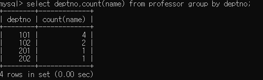
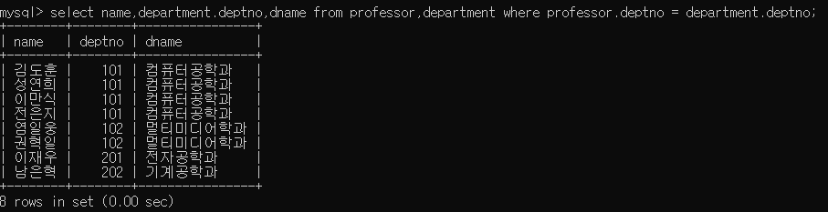

# 1. SQL 날짜 관련 함수

|이름|기능|
|---|---|
|now()|시스템의 현재 시각을 리턴한다|
|date_add(시각,interval 값 단위)|주어진 시각을 기준으로 날짜를 연산하여 리턴한다|
|date_format(시각,형식)|주어진 시각을 형식에 맞춰 변경한 결과를 리턴한다|
|||

## 1-1. date_format 함수에 사용 가능한 키워드

|키워드|기능|
|---|---|
|%Y|YYYY형식의 년도
|%y|YY형식의 년도|
|%M|달 이름|
|%m|MM형식의 월|
|%d|DD형식의 날짜|
|%e|D형식의 날짜|
|%W|요일이름|
|%a|요일 이름의 약자|
|%p|AM/PM|
|%H|HH형식의 시간(24시간제)|
|%k|H형식의 시간(24시간제)|
|%h|HH형식의 시간(12시간제)|
|%i|MM형식의 분|
|%s|SS형식의 초|
|||

> select now(); 
> select date_add(now(),interval 1 year); 
> select date_add(now(),interval -3 month) 
> select date_add(날짜 데이터 커럼이름,interval 값 단위); 
> select date_format(now(),'%y%m%d%h%i%s');

##  현재시간 조회 실행결과

##  현재로 부터 100일후 조회 실행결과

##  햔제럽 부터 7일 전 조회 실행결과

##  현재시간 형식변화 조회 실행결과

# 2. SQL 그룹함수

> 그룹 함수는 테이블의 전체 행을 하나 이상의 칼럼을 기준으로 칼럼 값에 따라 그룹화하여 그룹별로 결과를 출력하는 함수이다

|기능|설명|
|---|---|
|COUNT|행의 갯수 출력|
|MAX|null을 제외한 모든행에서 최대값을출력|
|MIN|null을 제외한 모든행에서 최소값 출력|
|SUM|null을 제외한 모든행의 합계|
|AVG|null을 제외한 모든행의 평균값|
|||

##  COUNT 실행결과

##  데이터만 조회한 실행결과

##  COUNT 조회 실행결과

##  COUNT 모든 데이터수 조회 실행결과

##  최대값 MAX 조회 실행결과

##  최소값 MIN 실행결과

##  합계 SUM 실행결과

##  평균 AVG 실행결과

##  다중 집계함수 조회 실행결과
;

# 3. SQL 그룹조회

## 3-1. group by

>특정 컬럼 값을 기준으로 테이블의 전체행을 그룹별로 나누기 위한 절

1. 그룹핑 전에 where절을 사용하여 그룹 대상을 먼저 선택가능
2. group by 절에는 반드시 컬럼이름이 포함되어야 하며 별명 사용 불가
3. select 절에서 집계 함수 없이 나열된 컬럼 이름이나 표현식은 group by 절에 반드시 포함되어야 함
4. group by 절에 나열된 컬럼 이름은 select 절에 명시하지 않아도됨.
5. select 절에서 그룹함수를 사용할 경우 group by 절에서 나눈 그룹안에서 집계를 수행한다

> select 컬럼이름 from <테이블이름> group by 컬럼이름 order by 컬럼이름 [정렬옵션];

### group by 실행결과

### group by, 그룹함수 실행결과

### group by 다중컬럼 실행결과

> group by 절에서 두개 이상의 컬럼을 콤마(,)로 구분하여 명시할 경우 첫 번째 컬럼에 대한 그룹을 형성하고, 각 그룹안에서 두 번째 컬럼에 대한 2차 그룹을 형성한다.

## 3-2. having

>select 명령문의 where절과 비슷한 기능을 하는 것으로 group by 절에서 조건 검색을 할 경우 반드시 having절을 사용해야 한다.

>select 컬럼이름,컬럼이름,그룹함수 from <테이블이름> group by 컬럼이름,컬럼이름 having 검색조건 order by 컬럼이름 [정렬옵션]

### 일반 group by 실행결과

### having 실행결과

>정렬조건에 select 에서 수행한 연산이나 집계 결과를 활용해야 할 경우 select 절에서 별칭을 명시하고 이를 참조하면 정렬 과정에서 발생하는 불필요한 추가 연산을 방지할수 있다.

### having 실행결과

데이터정규화

데이터원자성

# 4. JOIN

> 두 개 이상의 테이블을 결합하여 필요한 데이터를 조회하는 기능

## 4-1 JOIN의 종류

> 카디션 곱 (cross join), EQUI JOIN,INNER JOIN,OUTER JOIN 등이 있다

>카디션 곱의 원인

1. where 절에서 조인 조건을 명시하지 않거나 잘못 설정하여 양쪽테이블을 연결하는 조건을 만족하는 행이 하나도 없는 경우 발생한다.
2. 카디션 곱을 해결하기 위해서는 join의 조건이 되는 적절한 where절을 명시해야한다.

### 카디션 곱 실행결과

## 4-2. EQUI JOIN

>SQL 문에서 가장 많이 사용되는 조인으로 조인 대상 테이블에서 공통칼럼에 대하여  (=) 비교를 명시해, 같은 값을 갖는 행을 연결하여 결과를 생성하는 조인 방법이다.

>테이블 안에 같은 컬럼이 존재한다면이값을 사용하여 join조건을 명시하되 select 절에서 컬럼을 명시할때 어떤 테이블에 속한 컬럼인지를 명확히 하기 위해 (`테이블이름.컬럼`)의 형식을 사용해야 한다

> select 테이블이름1.컬럼,테이블이름2.컬럼 from 테이블이름1,테이블이름2 where 테이블이름1.컬럼 = 테이블이름2.컬럼

### EQUI JOIN 실행결과

### 4-2-1. EQUI JOIN 테이블 이름에 별칭 사용하기

> from 절에 명시되는 테이블 이름에 공백으로 구분하여 별칭을 적용하면 select 절이나 where 절에서 테이블이름의 풀네임을 명시하지 않아도 된다

### EQUI JOIN 별칭사용 실행결과

### 4-2-2. EQUI JOIN 추가 검색조건 명시하기

> 추가적인 검색조건은 and 연산자를 사용한다

### EQUI JOIN 추가 검색조건 실행결과

## 4-3. INNER JOIN

>EQUI JOIN에서 테이블이름을 구분하는 콤마(,)를 INNER JOIN 이라는 키워드로 변경하고 WHERE를 ON 키워드로 변경한다

>별칭사용은 EQUI JOIN과 같다

> select 테이블이름1.컬럼,테이블이름2.컬럼 from 테이블이름1 INNER JOIN 테이블이름2 ON 테이블이름1.컬럼=테이블이름2.컬럼;

### INNER JOIN  실행결과

### 4-3-1. INNER JOIN 추가 검색조건

>추가적인 검색조건은 ON 절 뒤에 where 절을 붙여 사용한다

### INNER JOIN 추가 검색조건 실행결과

## 4-4. OUTER JOIN

> INNER JOIN이 JOIN 조건에 부합하는 행들만 JOIN이 발생하는 것이라며느 OUTER JOIN은 조건에 부합하지 않는 행들까지도 포함시켜 결합하는 것을 의미한다.

|종류|설명|
|---|---|
|LEFT OUTER JOIN|join절에서 명시한 테이블 중, 왼쪽의 테이블에 대하여 조건에 부합하지 않는 데이터까지 조회한다|
|RIGHT OUTER JOIN|join절에서 명시한 테이블중,오른쪽의 테이블에 대하여 조건에 부합하지 않는 데이터까지 조회한다|
|FULL OUTER JOIN|join에서 사용하는 모든 테이블에서 조건에 부합하지 않는 데이터까지 조회한다. 시스템의 성능에 큰 영향을 주기때문에 실무에서는 사용하지 않는다|
|||

### INNER JOIN 실행결과

### LEFT OUTER JOIN 실행결과

### RIGHT OUTER JOIN 실행결과

## 4-5. 두개 이상의 테이블에 대한 JOIN

> 두개 이상의 테이블을 조인하는 경우 기준이 되는 하나의 테이블을 정하고, 기준 테이블에서 다른테이블을 조인하도록 작성한다

### EQUI JOIN 실행결과

>EQUI JOIN의 경우 where절에서 and 로구성하여 테이블을 조인한다

### INNER JOIN 실행결과

>INNER JOIN 의경우 기본이 되는 테이블과 다른테이블을 join할때 `inner join ~on`을 한단위로 구성한다

### OUTER JOIN 실행결과

